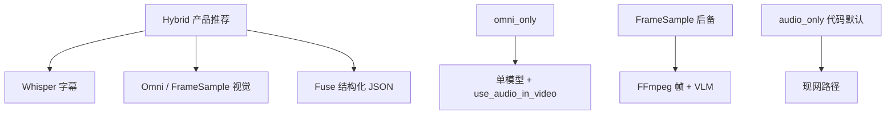
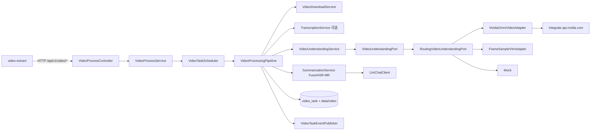
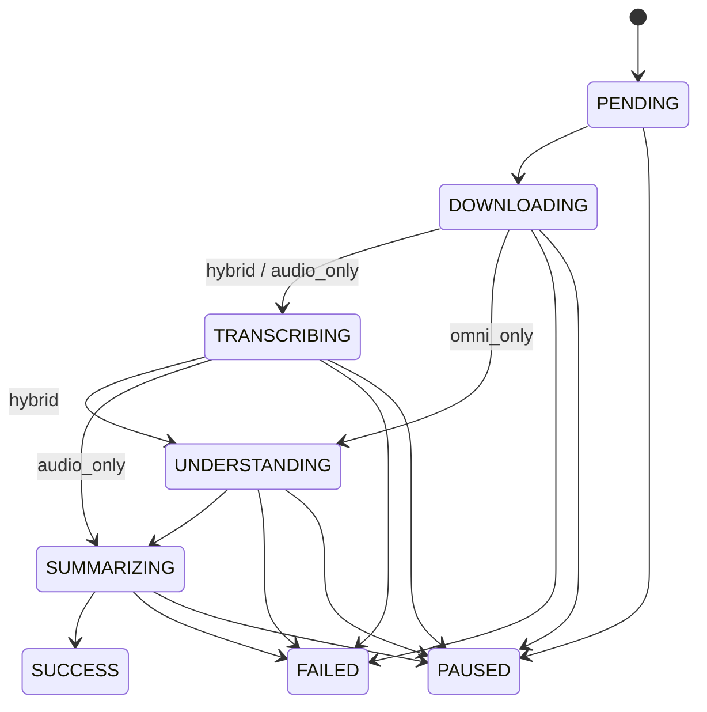
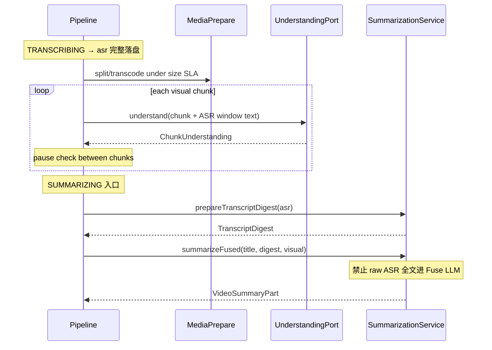
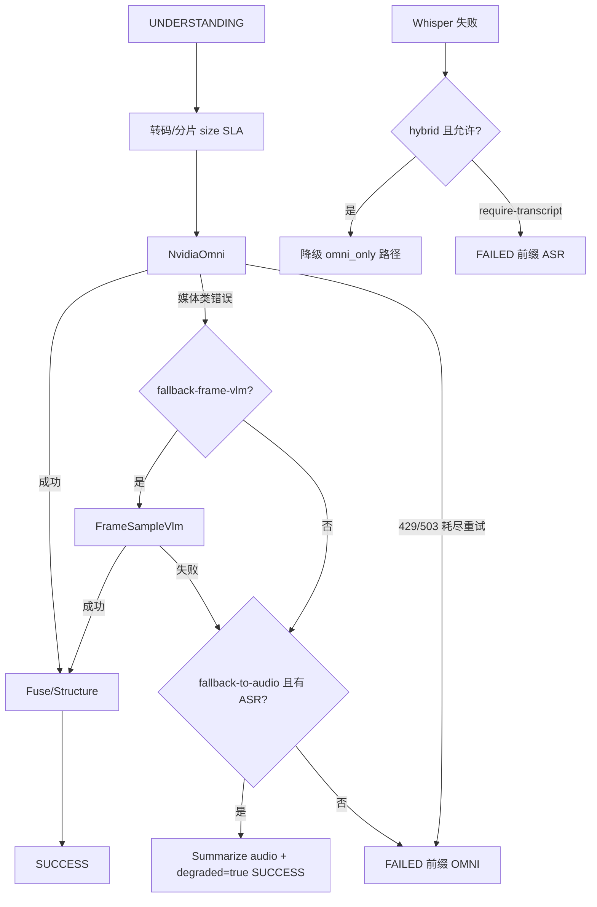

# VideoCoreExtractor 多模态视频理解架构设计方案

| 字段 | 内容 |
|------|------|
| **文档标题** | VideoCoreExtractor 从「音频转写 + 文本 LLM」升级为「视频多模态理解」 |
| **作者** | Grok Design（架构草案） / 待工程 Owner 会签 |
| **日期** | 2026-07-16 |
| **修订** | 2026-07-16 r3（Issue 20–23：TranscriptDigest 契约、FrameSample 默认、Omni 时长软顶、摘要同步） |
| **状态** | Draft |
| **模块** | `com.dwcode.okxbot.video`（VideoCoreExtractor） |
| **关联代码** | `VideoProcessingPipeline`、`VideoProcessService`、`VideoTaskScheduler`、`VideoTaskEventPublisher`、`SummarizationService`、`WhisperClient`、`LlmChatClient`、`AiModelConfigService`、`NvidiaFluxImageAdapter` |
| **关联文档** | `VideoCoreExtractor_核心逻辑与后端实现文档.md`、`VideoCoreExtractor_功能拓展与优化建议.md`、`AI文生图_架构设计方案.md`、`LangChain4j_三工具切换架构设计.md` |
| **规范副本** | 本文件与 `okx-bot/doc/VideoCoreExtractor_多模态视频理解_架构设计方案.md` 保持同内容 |

---

## Overview

当前 VideoCoreExtractor 流水线固定为 **下载 → Whisper 音频转写 → 文本 LLM 总结**，产物（要点、章节、思维导图、二创文案、可 seek 字幕）全部来自**语音通道**。对 UI 演示、幻灯片、产品展示、无口播画面、烧录字幕、B 站 PPT 课等视觉主导内容，系统等于「看不见画面」，用户明确要求停止依赖纯音频方案。

本方案在**不推倒重写**现有 Java 后端的前提下，引入 **视频多模态理解能力**（默认云端 NVIDIA Nemotron Omni 类模型，经 Port/Adapter 接入，对齐 imggen 的 `ImageGenPort` / `NvidiaFluxImageAdapter`），并推荐 **混合架构（Hybrid）**：

- **Whisper（可选保留）**：高精度、可 seek 时间轴字幕（产品交互刚需）
- **Video Omni / 抽帧 VLM**：理解画面、OCR 烧录字、场景与 UI 变化
- **融合总结（Fuse Summarize）**：ASR + 视觉理解 → 兼容 `VideoSummaryPart` 并扩展视觉字段

**默认值纪律（避免实现分歧）：**

| 阶段 | `video.understanding.mode` | 说明 |
|------|------------------------------|------|
| **代码/配置默认（P0–P1，直至 P2 go-live）** | **`audio_only`** | 新任务无 options 时行为与现网一致，零额外云成本 |
| **产品 go-live 后推荐默认** | **`hybrid`** | 运维翻转 yml（及可选白名单）后生效，见 [Rollout Plan](#rollout-plan) |

三种理解模式始终可用：`audio_only` | `hybrid` | `omni_only`。Omni 侧须遵守 [NVIDIA Omni 硬约束表](#53-nvidia-omni-硬约束表设计输入非开放假设)。

---

## Background & Motivation

### 现状（代码对齐 2026-07）

固定流水线（`VideoProcessingPipeline.run`）：

```
POST /process → video_task PENDING
→ @Async VideoProcessingPipeline
→ DOWNLOADING: yt-dlp + ffmpeg（video.* + audio.*）
→ TRANSCRIBING: TranscriptionService → WhisperClient → faster-whisper
→ SUMMARIZING: SummarizationService → LlmChatClient（text-only）
→ SUCCESS / FAILED
```

| 组件 | 路径 | 职责 |
|------|------|------|
| 编排 | `video/agent/VideoProcessingPipeline.java` | 固定 Download→Transcribe→Summarize |
| 下载 | `VideoDownloadService` | yt-dlp 限 720p、分轨 merge、抽 `audio.mp3` |
| 转写 | `TranscriptionService` + `WhisperClient` | OpenAI 兼容 `/v1/audio/transcriptions` |
| 总结 | `SummarizationService` | 字幕截断约 **24k 字符** → JSON：`keyPoints/chapters/mindMap/repurpose` |
| 暂停 | `VideoProcessService.pauseTask` | 仅允许 PENDING\|DOWNLOADING\|TRANSCRIBING\|SUMMARIZING |
| 调度 | `VideoTaskScheduler` | `MAX_CONCURRENT=2`；`countRunningInDb` 仅计上述三运行态 |
| 模型 | `ai_model_config.capability` | 现仅 `chat` / `image`（`normalizeCapability` 拒其它值） |
| LLM | `common.ai.LlmChatClient` | 纯文本；OkHttp readTimeout **180s** |
| 前端 | `okx-trading-web/src/views/video-extract/` | `STATUS_MAP` / `isRunning` / `pipelineSteps` 无 UNDERSTANDING；模型管理 `chat\|image` |

状态机：`PENDING / DOWNLOADING / TRANSCRIBING / SUMMARIZING / SUCCESS / FAILED / PAUSED`。

### 痛点

1. **无视觉理解**：画面信息完全丢失。
2. **长视频截断**：总结侧字幕 >24000 字符头尾截断，中间易丢。
3. **全量重试**：失败/改模型往往整管线重跑。
4. **Whisper 单点**：无口播时总结质量坍塌。
5. **能力模型混用**：视频页仅筛 `chat`，无法声明「视频 Omni」模型。

### 用户建议与评估立场

用户建议改用 `nvidia/nemotron-3-nano-omni-30b-a3b-reasoning`。本设计将其作为 **Omni 后端主选适配目标**，但架构上通过 Port/Adapter 可替换 host（NIM / OpenRouter 等）。**公开 NIM 文档中的硬限制（约 2 分钟视频、base64/URL、采样与 thinking 字段）作为设计输入**，不再当作未决 spike（见 §5.3）。

---

## Goals & Non-Goals

### Goals

1. **画面 + 语音均可利用**（hybrid / omni_only）；`audio_only` 仅作兼容与降级。
2. **可落地集成**：增量改造 `video` 包；Port/Adapter 对齐 imggen；复用 `ai.providers`。
3. **兼容现有产物**：保留 `keyPoints` / `chapters` / `mindMapMarkdown` / `repurposeScript` / `transcription.segments`。
4. **增强视觉字段**：`visualKeyPoints`、`onScreenTexts`、`scenes`、`visualSummary` 等（嵌在 `summary` 上，见 §7）。
5. **长视频策略**：分档 + **可实现的**均匀切分 / 稀疏采样算法 + **ASR 分层摘要**（硬性交付，禁止仅依赖 24k 截断）。
6. **模式可配置**：任务 options > yml；**代码默认 `audio_only`，go-live 翻 `hybrid`**。
7. **Whisper 可选项**：SRT / 高精度时间轴；Omni 失败可降级。
8. **中文产品语境**：抖音/B站/小红书。
9. **成本/时延/并发可控**：全局 ~2 并发；hybrid 软成本上限。
10. **状态端到端一致**：`UNDERSTANDING` 贯穿 enum / 暂停 / 调度 / SSE / DTO / 前端。

### Non-Goals（本阶段不做）

- 实时流式直播理解、端侧本地 30B Omni 集群。
- 自动剪辑导出、自动发帖、付费墙破解。
- 将 FLUX 与视频 Omni 硬合并为同一 Adapter。
- 多实例分布式调度重构（Redis 锁可后续）。
- 保证 Omni 字级时间戳替代 Whisper。
- 场景检测（FFmpeg scenedetect）作为 v1 主路径（延后 P3+）。
- 公网临时签名 URL 上传媒体（v1 **仅 base64**）。

---

## Key Decisions

| # | 决策 | 选择 | 理由 |
|---|------|------|------|
| D1 | 主架构 | **Hybrid（Whisper + Video Omni + 文本 Fuse）** | seek/SRT 刚需；纯 Omni 时间戳不可靠；纯音频无画面 |
| D2 | 默认 Omni 模型族 | **Nemotron Nano Omni**（`nvidia/nemotron-3-nano-omni-30b-a3b-reasoning`）经 NIM Chat | 与 `ai.providers.nvidia` 同网关；可换 host |
| D3 | 集成模式 | **`VideoUnderstandingPort` + Adapter** | 多模态载荷不宜进共享 `LlmChatClient` |
| D4 | 状态机 | **新增 `UNDERSTANDING`**，并 **全量 fan-out**（§3.2） | 否则暂停/并发/前端全错 |
| D5 | 长视频 v1 算法 | **中等：均匀切分；长：固定 stride 稀疏窗**；不做场景检测 | 可实现、可测、行为一致 |
| D6 | Whisper | hybrid 默认开；omni_only 可关；audio_only 强制 | 保留 SRT/搜索/seek |
| D7 | capability | **`video_omni`**；允许同 modelId 双行 (provider, model_id, capability) | 与 chat/image 隔离；UK 已支持 |
| D8 | 降级链 | **Omni → FrameSample → audio degraded → FAILED** | 有序、可分类错误 |
| D9 | 媒体清理 | **cleanup 只删媒体/分片，保留 `*.json`** | 支持重试与调试 |
| D10 | 总结职责 | Omni → `VisualUnderstandingResult`；Fuse → 产品 JSON | JSON 稳定、成本可控 |
| D11 | 媒体传输 | **v1 仅 base64 data URL**；无临时公网托管 | 栈内无对象存储公网暴露 |
| D12 | Reasoning | **结构化 Map：`enable_thinking=false`**；预算可配默认 1024 | 避免 content 空、JSON 污染 |
| D13 | omni 音频 | **`omni_only`：`use_audio_in_video=true`；hybrid 视觉片默认 strip 音轨** | hybrid 音已由 Whisper；减体积 |
| D14 | 任务内 chunk 并发 | **默认 1**（可配置，上限 2） | 防 NIM 配额与内存尖峰 |
| D15 | Feature flag | **v1 仅 yml**（`video.understanding.mode` + options）；白名单表非必须 | 简单可回滚 |
| D16 | 代码默认 mode | **`audio_only` until P2 go-live flip → `hybrid`** | 避免 day-1 意外计费/时延 |
| D17 | 响应形状 | **`summary` 上嵌视觉字段为规范**；`result.visual` 仅 debug/admin 可选 | 前端单一契约 |
| D18 | ASR 长文 | **分层 Map-Reduce 硬交付**；24k 仅 last-resort + 打日志 | 兑现长视频 Goal |
| D19 | Digest 所有权 | **Pipeline 在 SUMMARIZING 入口先 `prepareTranscriptDigest`；Fuse 只收 Digest，禁止 raw 全量 ASR 进最终 LLM** | 杜绝 hybrid 绕过分层（Issue 20） |
| D20 | Omni 时长软顶 | **`omni-max-duration-seconds`（默认=hybrid-max）对一切 `needsOmni()` 生效**；`on-omni-too-long` | 堵住 omni_only 成本洞 |

---

## Proposed Design

### 1. 方案比较

| 维度 | A. 纯 Omni | B. Hybrid（**推荐产品路径**） | C. 抽帧 VLM + ASR | D. 纯音频 |
|------|------------|-------------------------------|-------------------|-----------|
| 画面 | 强 | 强 | 中～强 | 无 |
| 时间轴/SRT | 弱～中 | **强** | 强 | 强 |
| 中文口播 | 依赖 Omni | Whisper + Omni | Whisper + 帧 | Whisper |
| 实现复杂度 | 中 | 中高 | 高 | 低（已有） |
| 故障面 | Omni 单点 | 三层降级 | 多组件 | Whisper+LLM |

**结论：产品推荐 B；代码默认先 D（`audio_only`）直至 go-live 翻 B。**  
A = `omni_only`。C = Adapter 后备 / `protocol=frame-vlm`。  
同一 model id 也可经 OpenRouter / DeepInfra 等 OpenAI 兼容 host 接入（换 `ai.providers.*.base-url` + Adapter 参数），不改编排层。



### 2. 目标架构



### 3. 理解模式与状态机

#### 3.1 Understanding Mode

| 模式 | 流水线 | 适用 |
|------|--------|------|
| **`audio_only`** | Download → Transcribe → Summarize | **代码默认**；兼容；降级终点 |
| **`hybrid`** | Download → Transcribe → Understanding → Fuse | **go-live 产品默认** |
| **`omni_only`** | Download → Understanding → Structure Summarize | 无口播；Whisper 故障回退 |

解析优先级：`options.understandingMode` > `video.understanding.mode` > 默认 `audio_only`。

#### 3.2 状态机



```java
public enum VideoTaskStatus {
    PENDING, DOWNLOADING, TRANSCRIBING, UNDERSTANDING, SUMMARIZING,
    SUCCESS, FAILED, PAUSED;

    public boolean isRunning() {
        return this == DOWNLOADING || this == TRANSCRIBING
            || this == UNDERSTANDING || this == SUMMARIZING;
    }
}
```

#### 3.3 UNDERSTANDING 状态 Fan-out 矩阵（必须一次改齐）

| 触点 | 文件/位置 | 变更 |
|------|-----------|------|
| 枚举 | `VideoTaskStatus` | +`UNDERSTANDING`；`isRunning()` 含之 |
| 暂停 allow-list | `VideoProcessService.pauseTask` | 允许 `UNDERSTANDING`（与 DOWNLOADING 等并列） |
| 调度占槽 | `VideoTaskScheduler.countRunningInDb`（及任何状态过滤） | **必须计入** `UNDERSTANDING`，否则超发 >2 |
| 流水线写状态 | `VideoProcessingPipeline.updateStatus` | 进入理解步写 `UNDERSTANDING` |
| 实体字段 | `VideoTaskEntity` | `understandDurationMs`、`understandingMode`、`omniProvider`、`omniModel`、`visualJson`、`visualPath`、`degraded`、`degradeReason` |
| API DTO | `VideoTaskResponse` | 同上字段对外暴露 |
| SSE 轻量载荷 | `VideoTaskEventPublisher.toLightData` | 含 `status`、`currentStep`、`understandDurationMs`、`understandingMode`、`degraded`、omni 快照 |
| 前端 running | `index.vue` `isRunning` | 含 `UNDERSTANDING` |
| 前端 STATUS_MAP | 同上 | 标签：「理解画面中」 |
| 前端 pipelineSteps | 同上 | **按 mode 动态**（§11） |
| 前端步骤耗时 | 耗时映射 | 绑定 `understandDurationMs` |
| 暂停文案 | `PAUSE_STEP_BOUNDARY_TIP` 类 | 标明 **长 Omni HTTP 无法中途 kill**，暂停在当前请求/分片结束后生效 |

**暂停语义（产品文案）：**

- 协作式：仅在步骤间隙与 **chunk 循环间隙** 检查 `isPauseRequested`。
- 单次 Omni HTTP（可能数分钟）与现网 Whisper/下载相同，**不可抢占**；UI 提示：「将在当前理解请求结束后暂停」。

### 4. 流水线编排

```java
DownloadResult dl = downloadService.download(...);
UnderstandingMode mode = resolveMode(task); // 默认 audio_only
// 下载后：凡 needsOmni() 均校验 omni-max-duration-seconds（§8.1 / §API）

TranscriptionResult asr = null;
if (mode.needsWhisper()) {
    updateStatus(TRANSCRIBING, "正在转录音频");
    asr = transcriptionService.transcribe(dl.getAudioPath(), language);
    persistTranscription(...); // 完整 segments 落库供 seek/SRT；与 Digest 无关
}

VisualUnderstandingResult visual = null;
if (mode.needsOmni()) {
    updateStatus(UNDERSTANDING, "正在多模态理解画面");
    long t0 = System.currentTimeMillis();
    // priorTranscript 仅用于 Map 窗对齐；允许传 raw ASR 或按窗切片文本
    visual = videoUnderstandingService.understand(...);
    task.setUnderstandDurationMs(System.currentTimeMillis() - t0);
    persistVisual(...);
}

// ========== SUMMARIZING：Digest 契约（D19，Issue 20）==========
updateStatus(SUMMARIZING, "正在融合生成结构化摘要");

// 1) 凡有 ASR，必须先产出 TranscriptDigest（audio_only / hybrid / 降级 audio 共用）
//    短字幕：prepareTranscriptDigest 可退化为「单窗直通」，但仍返回 Digest 类型
TranscriptDigest digest = null;
if (asr != null) {
    digest = summarizationService.prepareTranscriptDigest(
            asr, language, task.getLlmProvider(), task.getLlmModel());
    // 可选落盘 transcript_digest.json 便于调试；禁止把 raw 全文塞进 Fuse prompt
}

// 2) 产品 JSON：只吃 Digest + visual，永不吃 raw TranscriptionResult 全文
VideoSummaryPart summary;
if (mode == AUDIO_ONLY || (visual == null && digest != null)) {
    // audio_only，或 Omni 降级后仅文本
    summary = summarizationService.summarizeFromDigest(
            title, digest, mindMap, repurpose, language,
            task.getLlmProvider(), task.getLlmModel());
} else {
    // hybrid / omni_only（omni_only 时 digest 可为 null）
    summary = summarizationService.summarizeFused(
            title, digest, visual, mindMap, repurpose, language,
            task.getLlmProvider(), task.getLlmModel());
}

// result: summary（含视觉字段）+ transcription（仍挂完整 asr 供前端 seek）
```

#### 4.1 `SummarizationService` 方法契约（硬不变量）

| 方法 | 输入 | 职责 | 禁止 |
|------|------|------|------|
| **`prepareTranscriptDigest(asr, …)`** | 完整 `TranscriptionResult` | **唯一** ASR 分层 Map-Reduce 入口：分窗 → partial summaries → 合并为 `TranscriptDigest` | 静默 24k 截断后当最终总结；不产出产品 `VideoSummaryPart` |
| **`summarizeFromDigest(title, digest, …)`** | **仅** `TranscriptDigest` | audio_only / 降级路径的产品 JSON | 接收 raw `TranscriptionResult` 全文作 prompt |
| **`summarizeFused(title, digest, visual, …)`** | **`TranscriptDigest`（可 null）+ `VisualUnderstandingResult`** | hybrid/omni Fuse 产品 JSON | **签名不得再接收 raw `TranscriptionResult`**；内部不得绕过 Digest 拼全量字幕 |
| `summarize(...)`（旧） | — | **废弃或委托**：`digest = prepare…; return summarizeFromDigest…` | 旧 24k 头尾截断主路径 |

**不变量（实现 + Code Review 必查）：**

1. **Fuse / 最终总结 LLM 的 user prompt 中，字幕侧只允许出现 `TranscriptDigest` 序列化内容**（partials + overallDigest），不得拼接 `transcription.getText()` 或全量 segments 列表。  
2. **完整 ASR 仍写入 `transcription_json` / `result.transcription`**，仅服务 seek/SRT/搜索，与 Fuse prompt 解耦。  
3. **调用顺序（Pipeline 规范）：**  
   `asr → [UNDERSTANDING 可选] → prepareTranscriptDigest(asr) → summarizeFused|summarizeFromDigest`。  
   Digest 在 **SUMMARIZING 阶段、最终 LLM 之前** 生成；**不在 UNDERSTANDING 之前强制生成**（避免 Omni 失败已付 Digest 费用时可接受；若需省一次失败成本可缓存 digest 到任务目录）。  
4. **短字幕优化：** `prepareTranscriptDigest` 若全文长度不超过 `digest-single-window-chars`（默认 8000）可 **零次 Map LLM**，直接把全文装入单窗 Digest（`windowCount=1, mapLlmCalls=0`），仍走 Digest 类型，保证调用面统一。  
5. **降级路径：** `UnderstandingDegradedException` → 仍 `prepareTranscriptDigest` + `summarizeFromDigest`，`degraded=true`。  
6. **omni_only 无 ASR：** `digest=null`，`summarizeFused(title, null, visual, …)` 仅视觉。

**`TranscriptDigest` 最小字段：**

```java
@Data
public class TranscriptDigest {
    int windowCount;
    int mapLlmCalls;              // 验收：长字幕 ≥2
    boolean truncatedGuardHit;    // last-resort 单窗截断
    String overallText;           // reduce 后的口播总述（压缩）
    List<DigestWindow> windows;   // start/end + partialSummary + keyPoints 可选
    // 可选：保留少量锚定时间戳样本供 Fuse 对齐，禁止全量 segment dump
}
```

**PR-3 单测验收（必须）：**

- hybrid fixture：`transcription.text.length() > 24000` → 断言 `prepareTranscriptDigest` 的 **`mapLlmCalls >= 2`**（或 windowCount≥2 且每窗触发 map），且 **`summarizeFused` 入参类型为 TranscriptDigest**，spy/mock 最终 chat 的 user prompt **不含** 原始 24k+ 全文连续块。  
- audio_only 同长字幕同样走 `prepareTranscriptDigest`，禁止回归旧 `summarize(raw)` 截断路径。

步骤间隙与 chunk 循环内调用 `shouldPause`。

| 耗时字段 | 含义 |
|----------|------|
| `downloadDurationMs` | 已有 |
| `transcribeDurationMs` | 已有；跳过 ASR 为 null |
| `understandDurationMs` | **新增** |
| `summarizeDurationMs` | 融合/分层总结 |
| `totalDurationMs` | 已有 |

### 5. Port / Adapter

#### 5.1 Port

```java
public interface VideoUnderstandingPort {
    VisualUnderstandingResult understand(VideoUnderstandingCommand cmd) throws Exception;
}
```

`VideoUnderstandingCommand`：`taskId, videoPath, audioPath, durationSeconds, language, providerKey, modelId, protocol, priorTranscript, budget`。

`VisualUnderstandingResult`：`modelId, protocol, partial, overallVisualSummary, scenes, onScreenTexts, visualKeyPoints, chunks, rawJsonPath, metrics`。

Schema 冻结文件（PR-2 起）：`okx-bot/src/main/resources/video/visual_understanding.schema.json`（见附录 C）。

#### 5.2 Adapter 与有序路由（Fallback）

| Adapter | protocol | 职责 |
|---------|----------|------|
| `NvidiaOmniVideoAdapter` | `nvidia-omni-chat` | 原生 video base64 + NIM kwargs |
| `FrameSampleVlmAdapter` | `frame-vlm` | 抽帧 + 多图 VLM |
| `MockVideoUnderstandingAdapter` | `mock` | 测试 |

**`RoutingVideoUnderstandingPort` 选择与降级顺序（GA 必须）：**

```
1. protocol=mock → Mock
2. protocol=frame-vlm → FrameSample only
3. protocol=nvidia-omni-chat 或 auto（默认）:
   a. 预处理分片/转码后调用 NvidiaOmni
   b. 若错误可分类为媒体类（413、payload too large、unsupported video part、
      明确 “video” 相关 400、单片超限经 N 次重压仍失败）
      且 fallback-frame-vlm=true（hybrid GA 默认 true）
      → FrameSample 对同一时间窗重试
   c. 若仍失败且 fallback-to-audio=true 且 ASR 非空
      → 抛 UnderstandingDegradedException（管线捕获 → audio Fuse + degraded=true）
   d. 否则 FAILED，errorMessage 前缀 [OMNI]
4. 非媒体类 429/503：指数退避后失败，不自动切 FrameSample（避免掩盖限流）
```

`protocol=auto` 时首选 Omni，失败按上表；配置写死 `frame-vlm` 可强制跳过 Omni。

**PR 归属：** 路由骨架 + Omni 在 PR-4；**自动 FrameSample 回退必须在 PR-5 落地**（PR-6 实现 FrameSample 本体，PR-5 接线；若 PR-6 未合入则 `fallback-frame-vlm` 无效并打 warn，**hybrid GA 门禁要求 PR-6 已合**）。

#### 5.2.1 FrameSample 操作默认值（PR-6 / GA）

对**同一时间窗**（与 Omni 失败的 `chunkStartSec`–`chunkEndSec` 对齐）抽帧送多图 VLM，**输出仍校验附录 C Map schema**，服务端用同一套 `chunkStartSec` 做绝对化。

| 配置键 | 默认 | 说明 |
|--------|------|------|
| `frame-interval-seconds` | **2** | 窗内抽帧间隔（秒）；与视觉采样节奏对齐，独立于 Omni `target-fps` |
| `frame-max-per-chunk` | **8** | 单窗最多帧数；`min(ceil(windowLen/interval), max)` |
| `frame-max-edge` | **768** | 长边像素上限（等比缩放） |
| `frame-jpeg-quality` | **85** | JPEG 质量 |
| `frame-max-images-per-call` | **8** | 单次 VLM 请求最多图；超过则再拆子批（同一 chunk 内串行），合并 JSON |
| `frame-include-asr-window-text` | **true** | hybrid 时 user 文本附带该窗 ASR 切片 |

**算法（v1）：**

```
window = [chunkStart, chunkEnd]
times = chunkStart, chunkStart+interval, ... < chunkEnd  (cap frame-max-per-chunk)
ffmpeg -ss t -frames:v 1 -q:v ~quality → frames/f_{ms}.jpg  (scale max-edge)
content = [text prompt + optional ASR slice] + N × image_url data:image/jpeg;base64
→ 同一 Map JSON schema → ChunkUnderstanding
```

不采用场景检测；帧不足 1 张则该窗失败并走上层 fallback。PR-6 测试须覆盖上述默认与 schema 校验。

#### 5.3 NVIDIA Omni 硬约束表（设计输入，非开放假设）

来源：NVIDIA NIM / Nemotron 3 Nano Omni 公开模型卡与 API 说明（`integrate.api.nvidia.com` 默认按 **与 NIM 文档云端一致性** 设计；若实网差异仅作 **残差风险**，不阻塞本表作为实现契约）。

| 约束项 | 设计取值 | 配置键 / 实现点 |
|--------|----------|-----------------|
| 输入形态 | **`video_url`：公网 URL 或 `data:video/mp4;base64,...`** | v1 **只用 base64**（D11） |
| 单请求视频时长 | **硬顶 120s**（文档 ~2 min） | `chunk-seconds` 与 `sample-window-seconds` ≤ `max-request-video-seconds`（默认 **120**） |
| 采样 FPS | API 默认约 **2 FPS**；可经 kwargs 覆盖 | `media_io_kwargs.video.fps` ← `video.understanding.target-fps`（默认 **2**，与文档对齐；勿默认 3） |
| Thinking | **默认开启**；结构化任务须关 | `chat_template_kwargs.enable_thinking=false`（Map/结构化） |
| Thinking budget | 可配 | `thinking_token_budget` ← `video.understanding.thinking-token-budget` 默认 **1024**（OQ#6 关闭） |
| 视频内音频 | 可选 | hybrid 视觉片 **strip 音轨**；`omni_only` 设 `mm_processor_kwargs.use_audio_in_video=true` |
| 响应结构 | `reasoning` + `content` 分离 | 解析算法见 §5.4 |
| max_tokens | 过低可能导致 content 空 | Map 默认 **4096**；监控 empty content 后自动升档重试一次 |
| 传输体积 | base64 ≈ **4/3** 原始字节 | 见 §6.4 体积工程 |

**请求 extras 规范（Adapter 必填组装）：**

```json
{
  "model": "nvidia/nemotron-3-nano-omni-30b-a3b-reasoning",
  "temperature": 0.2,
  "max_tokens": 4096,
  "messages": [ /* system + user content parts */ ],
  "media_io_kwargs": { "video": { "fps": 2 } },
  "chat_template_kwargs": { "enable_thinking": false },
  "mm_processor_kwargs": { "use_audio_in_video": false }
}
```

`omni_only` 时：`use_audio_in_video=true`；若需短链推理排查可临时 `enable_thinking=true`（非默认）。

**为何不扩展 `LlmChatClient`：** 共享 Chat 为纯字符串 + 180s 读超时；视频需多 part、更大 body、独立 write/read/call 超时与 kwargs。与 FLUX 相同：**专用 Adapter + OkHttp 客户端**。

#### 5.4 响应提取算法（Adapter）

```
rawResponse = HTTP JSON
choice = choices[0].message
text = firstNonBlank(choice.content, choice.reasoning_content, choice.reasoning)
if text blank → retry once with max_tokens*=2 or FAILED [OMNI] empty content
json = LlmContentHelper.extractJsonObjectOrRaw(text)
validate against visual_understanding.schema.json (required keys)
map → ChunkUnderstanding / VisualUnderstandingResult
on validation fail → one repair prompt OR mark chunk failed
```

日志：截断错误体 ≤400 字符；**永不**打印 base64 与 Authorization。

### 6. 长视频策略（可实现算法）

#### 6.1 分档与参数默认

| 参数 | 默认 | 说明 |
|------|------|------|
| `max-request-video-seconds` | **120** | NIM 硬顶；任何送入 Omni 的片 ≤ 此值 |
| `short-max-seconds` | 90 | ≤ 此：single-shot（整段再压码） |
| `medium-max-seconds` | 600 | (short, medium]：均匀切分 |
| `chunk-seconds` | **90** | 均匀片长；且 `min(chunk-seconds, max-request-video-seconds)` |
| `sample-stride-seconds` | **60** | 长视频：每隔 N 秒开一个窗 |
| `sample-window-seconds` | **20** | 长视频：每窗 K 秒（≤120） |
| `max-chunks-per-task` | **20** | 硬顶 |
| `target-height` | **480** | 转码高度 |
| `target-fps` | **2** | 与 `media_io_kwargs.video.fps` 一致 |
| `max-upload-bytes` | **20_971_520**（20MiB） | **编码后原始文件**上限，非 base64 |
| `payload-headroom` | **0.7** | 目标编码大小 ≤ max-upload-bytes × 0.7 |
| `reencode-max-attempts` | **3** | 超限重压次数 |

分档规则：

| 时长 T | 算法 | `partial` |
|--------|------|-----------|
| T ≤ short | **Single-shot**：整段 transcode 一次调用 | false |
| short < T ≤ medium | **Uniform split only**（**无场景检测**） | false（全覆盖） |
| T > medium | **Sparse sample** | **true** |
| T > download.max-duration | 拒绝（现网 7200s） | — |

#### 6.2 Medium：均匀切分（v1 唯一）

```
chunkLen = min(chunk-seconds, max-request-video-seconds)  // 默认 90
starts = 0, chunkLen, 2*chunkLen, ... while start < T
last chunk may be shorter; if last < 2s merge into previous
numChunks = ceil(T / chunkLen)
if numChunks > max-chunks-per-task:
  // 拉大有效 chunk 或改为 sparse（实现选：改用 sparse 并 partial=true）
  switch to sparse algorithm
```

**不做** FFmpeg scenedetect（延后；与 FrameSample P3 可选增强绑定）。

#### 6.3 Long：稀疏采样

```
stride = sample-stride-seconds   // 60
window = min(sample-window-seconds, max-request-video-seconds)  // 20
starts = 0, stride, 2*stride, ... while start < T and chunks < max-chunks-per-task
each window: [start, min(start+window, T)]
partial = true
```

**ASR 对齐：** 每个视觉窗附带 ASR 子区间 `[start-5s, end+5s]`（边界夹紧）文本，供 Map prompt；**Fuse 阶段必须喂完整 ASR 分层摘要**（非仅窗内），因 `partial=true` 时画面未覆盖中间段。

#### 6.4 预处理与 base64 体积工程

目录：

```
{workDir}/{taskId}/
  video.mp4, audio.mp3
  transcription.json, visual_understanding.json, summary.json
  chunks/chunk_XXX.mp4
  frames/   # FrameSample
```

**Prep SLA（每片）：**

1. `ffmpeg`：scale 高度 ≤ `target-height`，fps=`target-fps`，`chunk-seconds`/`window` 切片。  
2. **hybrid：视觉片 strip 音轨**（`-an`）减体积；**omni_only：保留音轨**。  
3. 编码目标：`encodedBytes ≤ max-upload-bytes * payload-headroom`（默认 **≤ 14.6MiB**）。  
4. 超限：提高 CRF / 降 height 至 360 / 降 fps 至 1，最多 `reencode-max-attempts` 次。  
5. 仍超限：该片 `[OMNI] payload too large` → 路由 FrameSample 或失败。  
6. Base64 膨胀约 **4/3** → HTTP body ≈ `encoded * 4/3`；**禁止**在堆上同时保留「全部分片 base64」；逐片：读文件 → base64 → 请求 → 释放。  
7. OkHttp：**独立客户端** — `connect=30s`，`writeTimeout=120s`（大 body），`readTimeout=600s`，`callTimeout=write+read+30`。优先 `RequestBody` 自文件流式构建 JSON 若可行；否则控制单任务 chunk 串行（D14）。  
8. 内存风险：2 并发任务 × 单片 ~20MB 编码 × base64 字符串峰值 — 串行分片 + 及时 null 引用。

#### 6.5 Map-Reduce 与 ASR 分层（硬性）



**视觉 Map JSON：** 见附录 C（相对时间 + `chunkStartSec` 绝对化）。  

**ASR 分层（归属 `SummarizationService.prepareTranscriptDigest`，见 §4.1）：**

1. 将 `segments` 按约 3k–6k 字符或 3–5 分钟窗切分。  
2. 全文长度不超过 `digest-single-window-chars`（默认 8000）→ 单窗直通，`mapLlmCalls=0`。  
3. 否则每窗 chat 模型 partial summary → Reduce 合并为 `TranscriptDigest`。  
4. **`summarizeFused` / `summarizeFromDigest` 只消费 Digest**；完整 ASR 仅存 `result.transcription`。  
5. **Last-resort guard：** 单窗仍超限可截断 + `video.asr.truncate` 指标；**禁止**在 Fuse 侧对全文做 24k 头尾截断当主路径。

**Worked example：T = 20 min = 1200s（long sparse）**

| 项 | 值 |
|----|-----|
| stride / window | 60s / 20s |
| 理论窗数 | floor((1200-1)/60)+1 = **20** |
| max-chunks-per-task | 20 → **20 次 Omni 调用**（串行） |
| 每片编码目标 | ≤14.6MiB；磁盘 chunks 峰值 ≤ 20×15MiB ≈ **300MiB**（成功后 cleanup-chunks） |
| partial | true |
| ASR | 全量分层摘要参与 Fuse |
| 粗时延 | 20 × (转码+Omni 1–3min) → 易达 **数十分钟**；产品需展示进度「理解 3/20」 |

**Medium 例：T = 8 min = 480s**

| 项 | 值 |
|----|-----|
| chunkLen | 90s |
| 片数 | ceil(480/90) = **6** Omni 调用 |
| partial | false |

### 7. 输出 Schema（单一规范形状）

#### 7.1 规范响应形状（D17）

```json
{
  "videoId": "...",
  "title": "...",
  "duration": 123.4,
  "sourceUrl": "...",
  "understandingMode": "hybrid",
  "degraded": false,
  "degradeReason": null,
  "summary": {
    "keyPoints": [],
    "chapters": [],
    "mindMapMarkdown": "...",
    "repurposeScript": "...",
    "visualKeyPoints": [],
    "onScreenTexts": [],
    "scenes": [],
    "visualSummary": "...",
    "multimodal": true,
    "understandingMode": "hybrid",
    "partialVisual": false,
    "degraded": false,
    "degradeReason": null
  },
  "transcription": { "text": "...", "segments": [] }
}
```

- **规范：** 视觉字段在 **`summary` 上**（前端只读一处）。  
- **`result.visual` 原始 Map 大对象：** 不进默认 API；需要时 `GET ...?includeRawVisual=true`（admin/debug）或仅落盘 `visual_understanding.json`。  
- 任务列表/详情 DTO 另含：`omniProvider`、`omniModel`、`understandDurationMs`、`degraded`。

#### 7.2 时间戳策略

- 有 Whisper：视觉要点对齐最近 ASR segment；否则 `chunkStartSec + relativeSec`。  
- 无 Whisper：仅绝对时间轴。

#### 7.3 Fuse 冲突规则（写入版本化 prompt 常量 `FUSE_PROMPT_V1`）

1. 事实/数字/屏幕字：以 OCR/画面为准。  
2. 观点/口播金句：以 ASR 为准。  
3. `point` 可短标注来源 `[画面]` / `[口播]`。  
4. `partialVisual=true` 时章节与要点不得假装画面已覆盖未采样区间。  
5. `response_format=json_object` + ObjectMapper 直转。

### 8. 配置设计

#### 8.1 `application.yml`

```yaml
video:
  understanding:
    # 代码默认 audio_only；P2 go-live 改为 hybrid
    mode: audio_only
    mock: false
    provider: nvidia
    model: nvidia/nemotron-3-nano-omni-30b-a3b-reasoning
    protocol: auto   # auto | nvidia-omni-chat | frame-vlm | mock
    timeout-seconds: 600
    write-timeout-seconds: 120
    max-retries: 4
    retry-backoff-ms: 3000
    max-request-video-seconds: 120
    short-max-seconds: 90
    medium-max-seconds: 600
    chunk-seconds: 90
    sample-stride-seconds: 60
    sample-window-seconds: 20
    target-height: 480
    target-fps: 2
    max-chunks-per-task: 20
    max-upload-bytes: 20971520
    payload-headroom: 0.7
    reencode-max-attempts: 3
    chunk-concurrency: 1
    require-transcript: true
    fallback-to-audio: true
    fallback-frame-vlm: true
    cleanup-chunks: true
    enable-thinking: false
    thinking-token-budget: 1024
    # 软成本：比 download.max-duration-seconds 更严；0=不额外限制
    # 对 hybrid 与 omni_only（一切 needsOmni）在下载后二次校验
    hybrid-max-duration-seconds: 1800
    omni-max-duration-seconds: 1800   # 默认与 hybrid 相同；可单独收紧
    on-omni-too-long: reject          # reject | force_audio
    # 兼容别名：on-hybrid-too-long 读入时映射到 on-omni-too-long（若仅配其一）
    strip-audio-on-visual-chunks: true
    # FrameSample（§5.2.1）
    frame-interval-seconds: 2
    frame-max-per-chunk: 8
    frame-max-edge: 768
    frame-jpeg-quality: 85
    frame-max-images-per-call: 8
    frame-include-asr-window-text: true
    # ASR Digest
    digest-single-window-chars: 8000
    digest-window-chars: 4000
```

#### 8.2 `ai_model_config` / capability

**Allow-list（`normalizeCapability`）：** `chat` | `image` | **`video_omni`**。其它值抛业务异常。

| capability | 校验 |
|------------|------|
| `chat` | 现网 |
| `image` | 现网：`invokeUrl` 必填等 |
| **`video_omni`** | **`protocol` 建议必填**（`nvidia-omni-chat` \| `frame-vlm`）；**`invokeUrl` 不要求**（走 provider base-url + `/chat/completions`）。`validateVideoOmniFields`：modelId 非空；protocol 非法则 400 |

**OQ#2 关闭：允许 dual rows** — 同一 `(provider, model_id)` 可分别有 `chat` 与 `video_omni` 行（UK 已是 provider+model_id+capability）。

Seed：`enabled=0` 预置 Omni 行；部署文档注明 `schema.sql` 注释同步 capability 枚举（全量装库场景）。

#### 8.3 任务 Options 与表字段

```java
// VideoProcessOptions
String understandingMode;
String omniProvider;
String omniModel;
Boolean enableTranscript;
// 已有 llmProvider / llmModel → Fuse/chat
```

`video_task` 新增列见 [Data Model](#data-model-changes)。

### 9. Fallback 总图



错误前缀：`[DOWNLOAD]` / `[ASR]` / `[OMNI]` / `[FUSE]` / `[TOOL]`。

### 10. 成本、时延、存储、并发

- 全局任务并发 **2**；任务内 chunk 默认 **1**。  
- **Omni 软上限（D20）：** `omni-max-duration-seconds` 默认 **1800**（与 `hybrid-max-duration-seconds` 同默认）；**凡 `needsOmni()`（hybrid 与 omni_only）** 在下载得到 `durationSeconds` 后校验。  
  - `on-omni-too-long=reject`（默认）：任务 **FAILED**，文案提示改 `audio_only` 或缩短源。  
  - `on-omni-too-long=force_audio`：仅当 hybrid 可降级时改走 audio_only（写 `degraded`/`degradeReason=omni_duration_cap`）；**omni_only 无 ASR 意图时 force_audio 仍 REJECT**。  
- 短视频 hybrid P50 目标 < 8min（粗估）。  
- 存储：`cleanup-chunks` 成功后删 chunks/frames；见 §12 cleanup 重定义。  
- 失败路径：任意阶段失败也 **best-effort 删除 chunks/**，避免残留打满磁盘。

### 11. 前端协作

路径：`okx-trading-web/src/views/video-extract/`

#### 11.1 Mode-aware pipelineSteps

```ts
function pipelineSteps(mode: UnderstandingMode): Step[] {
  if (mode === 'audio_only')
    return ['PENDING','DOWNLOADING','TRANSCRIBING','SUMMARIZING','SUCCESS']
  if (mode === 'omni_only')
    return ['PENDING','DOWNLOADING','UNDERSTANDING','SUMMARIZING','SUCCESS']
  // hybrid
  return ['PENDING','DOWNLOADING','TRANSCRIBING','UNDERSTANDING','SUMMARIZING','SUCCESS']
}
```

进度条 index 按当前 mode 的 steps 计算；未知 status 显示 raw + 不打断 running 判断。

#### 11.2 其它 UI

| 项 | 要求 |
|----|------|
| 提交 | 模式三选一；**总结模型** chat 下拉；**理解模型** `capability=video_omni` 下拉（mode 需 Omni 时必选） |
| degraded 条 | 「未完整使用画面理解：{degradeReason}，结果可能不完整」 |
| 视觉面板 | 画面要点 / 屏幕文字 / 场景（读 `summary.*`） |
| 暂停 tip | 含 UNDERSTANDING：当前 Omni 请求结束后暂停 |
| ModelManageModal | capability 联合类型 `'chat'\|'image'\|'video_omni'` |
| 模型测试 | 见 § API：video_omni **不得**静默复用 10s 聊天探针而不标注 |

### 12. 清理、重试、暂停

#### 12.1 cleanupMedia 重定义

| 旧行为 | 新行为 |
|--------|--------|
| 成功后删**整个任务目录**并清空 video/audio/**transcription/summary paths** | 仅删 **`video.*`、`audio.*`、`chunks/`、`frames/`** |
| JSON 被干掉 | **保留** `transcription.json` / `summary.json` / `visual_understanding.json` 及 DB 中对应 JSON 列 |
| 路径字段 | 清空媒体路径；**保留** transcriptionPath/summaryPath/visualPath 或仍指向 JSON |

理解完成前禁止任何 cleanup。`cleanup-chunks=true`：理解成功后即可删 chunks/frames（早于可选的媒体 cleanup）。

#### 12.2 重试

| 阶段 | 行为 |
|------|------|
| **Phase-1（至 PR-8 前）** | 仍 **全量** `deleteTaskDir` 媒体+可重跑；实现保持简单 |
| **PR-8 partial** | `fromStep=TRANSCRIBING\|UNDERSTANDING\|SUMMARIZING` |

**Partial 不变量：**

- `fromStep=SUMMARIZING`：需要 `transcription_json` 非空（audio/hybrid）或 `visual_json` 非空（omni_only）；**不需要**媒体文件。  
- `fromStep=UNDERSTANDING`：**媒体 `video_path` 文件必须存在**；否则自动降级全量重跑或 400。  
- `fromStep=TRANSCRIBING`：需要 `audio_path` 或 video 可再抽音。  
- 若 `cleanupMedia` 已删媒体，禁止 UNDERSTANDING 续跑。

`VideoRetryRequest` 扩展：`llmProvider/llmModel`（已有）、**`omniProvider/omniModel`、`understandingMode`、`fromStep`**。

### 13. 中文场景专项

| 场景 | 策略 |
|------|------|
| 抖音口播+花字 | Whisper + OCR 花字 Fuse |
| B 站 PPT | OCR/场景权重高 |
| 小红书产品 | visualKeyPoints + 时间码 |
| 无口播 | omni_only；`use_audio_in_video` 按需 |
| 方言嘈杂 | hybrid 允许视觉补；ASR 差时 degraded 提示 |

---

## API / Interface Changes

### 模型列表

**现网问题：** `GET /api/v1/video/models` 固定 `listEnabledGroupedByProvider()` → 仅 chat。

**规范：**

```
GET /api/v1/video/models?capability=chat|image|video_omni
```

- 缺省 `capability=chat`（兼容）。  
- Controller 将 query 传入 `AiModelConfigService.listEnabledGroupedByProvider(capability)`。  
- 不强制新增 `/models/video-omni`（可选别名 302/转发，非必须）。

### 提交校验 `POST /process`

当 `resolveMode().needsOmni()`：

1. 解析 `omniProvider` / `omniModel`（options > yml understanding.*）。  
2. 校验 provider 在 yml 且 api-key 非空。  
3. 校验库中存在 **enabled + capability=video_omni** 的该 model（或 yml 允许的 bypass 仅限 mock）。  
4. **时长软顶（下载后必检，hybrid 与 omni_only 相同）：**  
   `limit = omni-max-duration-seconds`（若为 0 则回退 `hybrid-max-duration-seconds`；皆 0 则不额外限制）。  
   若 `durationSeconds > limit`：按 `on-omni-too-long` 执行 reject 或 force_audio（§10）。  
5. chat 模型校验保持现网（Fuse / Digest 需要；omni_only 无 ASR 时仍可能要 chat 做 Structure）。

`needsWhisper()` 且 Whisper 托管启用时，可选预检 `/health`（非阻塞 warning）。

### 重试 `POST /tasks/{id}/retry`

Body 扩展字段见 §12.2；校验逻辑与 submit 一致（若覆盖 omni/mode）。

### 模型测试 `POST /models/test`

| capability | 行为 |
|------------|------|
| chat | 现网短文本 ping，`testTimeoutSeconds`（默认 10s） |
| video_omni | **独立**：默认「配置校验 + 可选 1 帧/极短样例」；超时 **≥60s**；UI 标注「视频探针较慢」；P1 可先 **配置存在性检查** 并返回 `probeLevel=config_only`，完整视频探针 P2+ |

### DTO / SSE 字段表

| 字段 | TaskResponse | SSE light | 列表 | 详情 |
|------|--------------|-----------|------|------|
| status / currentStep | ✓ | ✓ | ✓ | ✓ |
| understandingMode | ✓ | ✓ | ✓ | ✓ |
| llmProvider / llmModel | ✓ | ✓ | ✓ | ✓ |
| omniProvider / omniModel | ✓ | ✓ | ✓ | ✓ |
| understandDurationMs | ✓ | ✓ | 可选 | ✓ |
| degraded / degradeReason | ✓ | ✓ | ✓ | ✓ |
| result.summary.* 视觉字段 | 详情 result | — | — | ✓ |

### 内部接口

| 接口 | 变更 |
|------|------|
| `VideoUnderstandingPort` + Routing | 新增 |
| `SummarizationService.prepareTranscriptDigest` | **新增；ASR 分层唯一入口** |
| `SummarizationService.summarizeFromDigest` | **新增；audio_only / 降级** |
| `SummarizationService.summarizeFused(title, TranscriptDigest, visual, …)` | **新增；digest 可 null；禁止 raw ASR 参数** |
| `summarize(...)` / `summarizeHierarchical` | 委托 `prepare + summarizeFromDigest` 或删除对外暴露 |
| `VideoTaskStatus` | +UNDERSTANDING + fan-out |
| `AiModelConfigService.CAP_VIDEO_OMNI` | 新增 |
| `TranscriptDigest` DTO | 新增 |

---

## Data Model Changes

```sql
ALTER TABLE video_task
  ADD COLUMN understanding_mode VARCHAR(32) NULL COMMENT 'hybrid|omni_only|audio_only' AFTER llm_model,
  ADD COLUMN omni_provider VARCHAR(64) NULL AFTER understanding_mode,
  ADD COLUMN omni_model VARCHAR(128) NULL AFTER omni_provider,
  ADD COLUMN visual_json MEDIUMTEXT NULL COMMENT '视觉理解 JSON' AFTER summary_json,
  ADD COLUMN visual_path VARCHAR(512) NULL AFTER transcription_path,
  ADD COLUMN understand_duration_ms BIGINT NULL AFTER transcribe_duration_ms,
  ADD COLUMN degraded TINYINT NOT NULL DEFAULT 0 AFTER error_message,
  ADD COLUMN degrade_reason VARCHAR(512) NULL AFTER degraded;
```

`ai_model_config`：业务 allow-list 扩 `video_omni`；seed `enabled=0`；`schema.sql` 注释同步。

**迁移：** 旧任务 `understanding_mode=null` → 读作 **`audio_only` 语义**。回滚：yml 保持/改回 `audio_only`。

---

## Alternatives Considered

### Alt-1：纯 Omni 端到端

链路短；时间轴/SRT 与降级弱 → 仅 `omni_only`。  
**多 host：** 同一模型 id 可走 OpenRouter/DeepInfra 等 OpenAI 兼容端点，仅换 provider 配置，不改 Port 契约。

### Alt-2：仅抽帧 VLM + Whisper

可控但易漏帧 → **有序降级第 2 层**，非默认。

### Alt-3：外挂 Python 多模态微服务

本地 GPU 远期；本阶段不做。

### Alt-4：只做文本 Map-Reduce

解决 24k 但不解决画面 → **作为 hybrid 子能力硬交付**，不单独充当升级叙事。

---

## Security & Privacy Considerations

| 风险 | 严重度 | 缓解 |
|------|--------|------|
| 视频上传第三方云 | 高 | 产品告知；`audio_only`；后续私有化 Adapter |
| API Key 泄漏 | 高 | yml/env；日志禁 Authorization/base64 |
| 屏幕文字提示注入 | 中 | Fuse 系统提示 + JSON schema |
| 路径穿越 | 中 | 仅任务目录 |
| 磁盘打满 | 中 | max-chunks、失败清理 chunks、cleanup 策略 |
| **Hybrid/Omni 成本滥用** | 中 | `omni-max-duration-seconds` + `on-omni-too-long`（**needsOmni 全覆盖**）；全局并发 2；**v1 无 per-user 日预算**；可 admin 保持 `mode=audio_only` |
| 多租户串读 | 中 | 现网 user_id 隔离 |

---

## Observability

### 日志（PR-2 起必需）

`taskId, mode, provider, model, stage, durationMs, chunkIndex/chunkTotal, partial, degraded, errorPrefix`。

### 指标（PR-5 GA 最低集 — 非可选）

| 指标 | 说明 |
|------|------|
| `video.stage.duration{stage}` | 阶段耗时（Timer） |
| `video.omni.errors{code}` | Omni/Frame 失败 Counter |
| `video.degraded` | 降级 SUCCESS Counter |
| `video.asr.truncate` | 触发 last-resort 截断 |
| `video.omni.chunks` | 分片数 DistributionSummary |

### 告警

- Whisper health 失败。  
- Omni 5xx/429 升高。  
- `data/video` 磁盘 **>80%**。  
- 失败任务 chunks 目录残留（定时扫描可选）。

### 失败路径清理

`finally` / catch：若存在 `chunks/` 或 `frames/` 且任务 FAILED/PAUSED，best-effort 删除（配置 `cleanup-chunks-on-failure=true` 默认 true）。

---

## Rollout Plan

| 阶段 | 内容 | mode 默认 |
|------|------|-----------|
| **P0** | PR-1+2：fan-out、Port、Mock、schema 冻结 | **audio_only** |
| **P1** | PR-3+4：Fuse/ASR-MR 骨架、Omni 短片 | **audio_only**；内测 options 强开 hybrid |
| **P2 go-live** | PR-5+6+7：分片、路由降级、FrameSample、前端 | **yml 翻 hybrid** |
| **P3** | PR-8 partial retry；可选 scenedetect | hybrid |
| **Rollback** | `video.understanding.mode=audio_only` | 即时 |

**Go-live flip 规程：**

1. 确认 PR-5/6/7 验收 + NIM 冒烟。  
2. 改 yml `mode: hybrid`（或部署环境变量）。  
3. 观察 `video.degraded` / omni.errors / 磁盘 24h。  
4. 异常 → 改回 `audio_only`（无需迁库）。

v1 **无**用户白名单表（D15）；内测用 options 或独立环境 yml。

---

## Risks

| 风险 | 严重度 | 缓解 |
|------|--------|------|
| integrate.api 与 NIM 文档参数不一致 | 中 | 约束表按文档实现；差异作残差 + Adapter 开关 |
| 单请求 **120s** 硬顶被忽略导致 4xx | 高 | `max-request-video-seconds` 强制夹紧所有片 |
| Thinking 默认开导致空 content | 高 | `enable_thinking=false` + 提取算法 |
| Base64 内存/写超时 | 高 | headroom 0.7、writeTimeout、串行 chunk |
| UNDERSTANDING 漏改调度 | 高 | Fan-out 矩阵 PR-1 验收清单 |
| 长视频 20 次调用过慢 | 中 | sparse 参数、进度文案、hybrid 时长软顶 |
| 全量重试浪费（PR-8 前） | 中 | 文档明示；优先修 Omni 稳定性 |

---

## Open Questions

| # | 状态 | 结论 / 残留 |
|---|------|-------------|
| OQ1 媒体形态/时长 | **关闭** | base64 + URL 均支持；v1 base64；**120s/请求**；见 §5.3 |
| OQ2 双 capability 行 | **关闭** | **允许** dual rows |
| OQ3 会员配额 | **打开** | 非本迭代；有 soft 时长顶 |
| OQ4 仅重理解 API | **打开** | PR-8 `fromStep` 覆盖 |
| OQ5 OCR 并入 SRT 轨 | **打开** | 非 v1 |
| OQ6 thinking budget | **关闭** | 配置项默认 **1024**；结构化默认关 thinking |

**残留风险（非 OQ）：** 自建 NIM 与云目录字段名细微差异 — 实现期用单测夹具 + 一次实网冒烟记录到 PR-4 描述。

---

## References

- 仓库：`VideoCoreExtractor_*.md`、`AI文生图_架构设计方案.md`、`LangChain4j_三工具切换架构设计.md`
- 代码：`VideoProcessingPipeline`、`VideoProcessService.pauseTask`、`VideoTaskScheduler`、`SummarizationService`、`AiModelConfigService`、`imggen` Port/Adapter
- 外部：NVIDIA Nemotron 3 Nano Omni / NIM — video ≤~2min、`video_url` base64|URL、`media_io_kwargs`、`enable_thinking`、`use_audio_in_video`

---

## PR Plan

### 合同冻结

- **PR-2** 合入 `visual_understanding.schema.json` + Mock fixture；PR-3/4 **不得破坏** required 字段（仅可加可选字段）。  
- **PR-3** 冻结 `VideoSummaryPart` 视觉扩展字段名供前端并行（PR-7）。

### PR-1：数据模型、状态 Fan-out、配置骨架

- **标题**：`feat(video): UNDERSTANDING fan-out, understanding config, DB columns`
- **影响**：`VideoTaskStatus`；`pauseTask` allow-list；`VideoTaskScheduler.countRunningInDb`；`VideoTaskEntity`/DTO/`toLightData`；`VideoProperties`；SQL alter；`AiModelConfigService` allow-list + `validateVideoOmniFields`；`GET /models?capability=`；submit 校验骨架（mode=audio_only 时 omni 不强制）
- **依赖**：无
- **测试**：单元测 isRunning/pause/scheduler 计数含 UNDERSTANDING；capability 校验；默认 mode=`audio_only`
- **验收清单**：§3.3 矩阵每一行有代码 diff

### PR-2：Port + Mock + Pipeline 分支 + Schema 冻结

- **标题**：`feat(video): VideoUnderstandingPort, mock adapter, hybrid skeleton`
- **影响**：port/adapter/mock；`VideoUnderstandingService`；Pipeline 分支；`visual_understanding.schema.json` + fixture；Storage 路径；结构化日志
- **依赖**：PR-1
- **测试**：Mock hybrid 任务 SUCCESS；omni_only 跳过 ASR；schema 校验 fixture

### PR-3：Fuse Schema + ASR Digest 契约（硬）

- **标题**：`feat(video): TranscriptDigest prepare + fused summary without raw ASR`
- **影响**：`TranscriptDigest`；`prepareTranscriptDigest` / `summarizeFromDigest` / `summarizeFused(digest, visual)`；`VideoSummaryPart` 视觉扩展；Pipeline §4 调用序；废弃 raw 24k 主路径；`FUSE_PROMPT_V1`
- **依赖**：PR-2（视觉类型以 schema 为准）
- **测试（验收）：**  
  - 长字幕 >24k：`mapLlmCalls >= 2`（或 windowCount≥2 且 map 被调用）  
  - hybrid：`summarizeFused` **仅**收 `TranscriptDigest`，最终 prompt 无 raw 全文  
  - audio_only 委托同一 prepare  
  - 短字幕单窗直通 `mapLlmCalls=0`

### PR-4：NvidiaOmniVideoAdapter 短视频 + NIM gate

- **标题**：`feat(video): NVIDIA Omni adapter (≤120s) with documented kwargs`
- **影响**：`NvidiaOmniVideoAdapter`；MediaPrepare 压码；独立 OkHttp 超时；seed SQL
- **依赖**：PR-2、PR-3
- **Gate（PR 描述必须附）：**  
  1. 实网或官方示例确认 `video_url` data: base64  
  2. `enable_thinking=false` 返回可解析 JSON  
  3. 单请求 >120s 的错误形态记录  
  4. 体积超限错误码记录  
- **测试**：MockWebServer 契约；本地可选 `@EnabledIf` 实网

### PR-5：长视频算法 + 有序 Fallback 接线 + 指标

- **标题**：`feat(video): uniform/sparse chunking, fallback chain, metrics`
- **影响**：§6.2–6.3 算法；Routing 降级；失败清理 chunks；Micrometer 最低集；hybrid 时长软顶；chunk 进度 currentStep
- **依赖**：PR-4；**FrameSample 接口可先 no-op 直至 PR-6**
- **测试**：算法单测（20min → 20 窗）；媒体错误触发 fallback 路径；degraded SUCCESS
- **GA 门禁**：与 PR-6 同时满足才允许 yml 默认 hybrid

### PR-6：FrameSampleVlmAdapter（hybrid GA 必需）

- **标题**：`feat(video): FrameSampleVlmAdapter for media fallback`
- **影响**：§5.2.1 默认配置；抽帧 Adapter；附录 C schema；`fallback-frame-vlm` 真正生效
- **依赖**：PR-4；与 PR-5 可并行但 **GA 需两者**
- **测试**：默认 2s/最多 8 帧/edge 768；强制 protocol=frame-vlm；Omni 413 模拟切帧；schema 校验

### PR-7：前端

- **标题**：`feat(video-extract): multimodal mode, UNDERSTANDING UX, visual panels`
- **影响**：`index.vue` mode-aware steps/isRunning/STATUS_MAP；degraded 条；双模型下拉；`ModelManageModal` video_omni；测试按钮矩阵
- **依赖**：PR-1（状态/API）；字段契约 PR-3；完整视觉 PR-4+
- **测试**：组件/手工清单：三 mode 进度条；暂停 tip

### PR-8（增强）：Partial retry

- **标题**：`feat(video): partial retry fromStep + cleanup media-only`
- **影响**：retry DTO；跳步 Pipeline；cleanupMedia 新语义落地（可与 PR-5 提前做清理重定义）
- **依赖**：PR-5
- **测试**：fromStep 不变量；无媒体时 UNDERSTANDING 续跑拒绝

### 工作量粗估（1 名熟悉本仓后端）

| PR | 人日（约） |
|----|------------|
| PR-1 | 2–3 |
| PR-2 | 2–3 |
| PR-3 | 3–4 |
| PR-4 | 3–5（含 gate） |
| PR-5 | 3–4 |
| PR-6 | 2–3 |
| PR-7 | 2–3 |
| PR-8 | 2–3 |

---

## 附录 A：推荐默认参数速查

| 参数 | 值 |
|------|-----|
| 代码 mode | `audio_only` |
| go-live mode | `hybrid` |
| max-request-video-seconds | 120 |
| chunk-seconds | 90 |
| sample-stride / window | 60 / 20 |
| target-fps / height | 2 / 480 |
| payload-headroom | 0.7 |
| enable-thinking（Map） | false |
| thinking-token-budget | 1024 |
| chunk-concurrency | 1 |
| 全局任务并发 | 2 |
| hybrid-max-duration-seconds | 1800 |
| omni-max-duration-seconds | 1800 |
| on-omni-too-long | reject |
| frame-interval-seconds / max-per-chunk | 2 / 8 |
| frame-max-edge | 768 |
| digest-single-window-chars | 8000 |

## 附录 B：改造触点映射

| 现网 | 动作 |
|------|------|
| `VideoProcessingPipeline` | mode 分支 + UNDERSTANDING；SUMMARIZING 先 `prepareTranscriptDigest` 再 Fuse |
| `VideoProcessService.pauseTask` | allow UNDERSTANDING；submit/retry 校验 omni；omni 时长软顶 |
| `VideoTaskScheduler` | running 计数 + UNDERSTANDING |
| `VideoTaskEventPublisher` | light 字段 |
| `SummarizationService` | `prepareTranscriptDigest` + `summarizeFromDigest` / `summarizeFused(digest,…)` |
| `TranscriptionService` | 可跳过 |
| `WhisperClient` | 保留 |
| `LlmChatClient` | 仅 Fuse/ASR-MR |
| `AiModelConfig*` | video_omni |
| `StorageService` | visual/chunks；cleanup 语义 |
| 前端 video-extract | §11 |

## 附录 C：Map 阶段 JSON Schema（冻结草案）

`visual_understanding.schema.json` 核心 required：

```json
{
  "$schema": "https://json-schema.org/draft/2020-12/schema",
  "type": "object",
  "required": ["chunkStartSec", "chunkEndSec", "visualSummary", "scenes", "onScreenTexts", "visualKeyPoints"],
  "properties": {
    "chunkStartSec": { "type": "number", "minimum": 0 },
    "chunkEndSec": { "type": "number", "minimum": 0 },
    "visualSummary": { "type": "string" },
    "scenes": {
      "type": "array",
      "items": {
        "type": "object",
        "required": ["relStartSec", "relEndSec", "description"],
        "properties": {
          "relStartSec": { "type": "number" },
          "relEndSec": { "type": "number" },
          "description": { "type": "string" },
          "tags": { "type": "array", "items": { "type": "string" } }
        }
      }
    },
    "onScreenTexts": {
      "type": "array",
      "items": {
        "type": "object",
        "required": ["relStartSec", "text"],
        "properties": {
          "relStartSec": { "type": "number" },
          "text": { "type": "string" },
          "source": { "type": "string", "enum": ["ocr", "caption", "slide", "other"] }
        }
      }
    },
    "visualKeyPoints": {
      "type": "array",
      "items": {
        "type": "object",
        "required": ["relStartSec", "point"],
        "properties": {
          "relStartSec": { "type": "number" },
          "point": { "type": "string" },
          "evidence": { "type": "string" }
        }
      }
    }
  }
}
```

**时间约定：** 模型输出 **片内相对秒** `relStartSec`；服务端绝对化：`abs = chunkStartSec + relStartSec`，格式化为 `HH:mm:ss` 写入产品 DTO。空列表合法。

**Map system 提示要点：** 只输出 JSON；无 markdown 围栏；中文；禁止编造未出现的屏幕文字。

**Reduce/Fuse 输入组装（与 §4.1 一致）：**

```
// 由 Pipeline 调用，禁止在 summarizeFused 内偷偷吃 raw ASR
digest = SummarizationService.prepareTranscriptDigest(asr)  // asr 可为 null → digest null

summarizeFused / summarizeFromDigest 的 LLM 输入 =
  TranscriptDigest (overallText + windows[].partialSummary)   // 非 raw segments dump
  + merged VisualUnderstandingResult (abs times, partial flag)
  + title, language, mindMap/repurpose flags
→ VideoSummaryPart JSON

result.transcription = 完整 asr   // 仅 API 展示，不进 Fuse prompt
```

## 附录 D：Omni 请求/解析伪代码

```java
// 构建
body.put("media_io_kwargs", Map.of("video", Map.of("fps", fps)));
body.put("chat_template_kwargs", Map.of("enable_thinking", false));
body.put("mm_processor_kwargs", Map.of("use_audio_in_video", useAudioInVideo));
// user content
List<Object> parts = List.of(
  Map.of("type", "text", "text", mapPrompt),
  Map.of("type", "video_url", "video_url", Map.of("url", "data:video/mp4;base64," + b64))
);

// 解析
String content = message.path("content").asText(null);
if (isBlank(content)) content = message.path("reasoning").asText(null);
String json = LlmContentHelper.extractJsonObjectOrRaw(content);
JsonNode node = mapper.readTree(json);
schemaValidator.validate(node);
```
