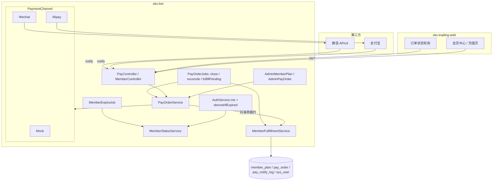
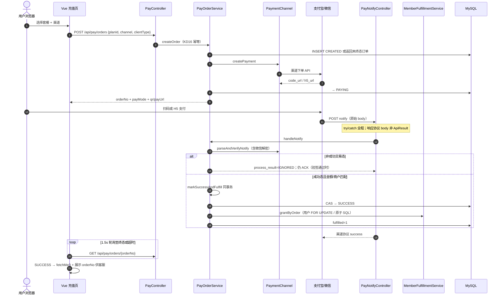
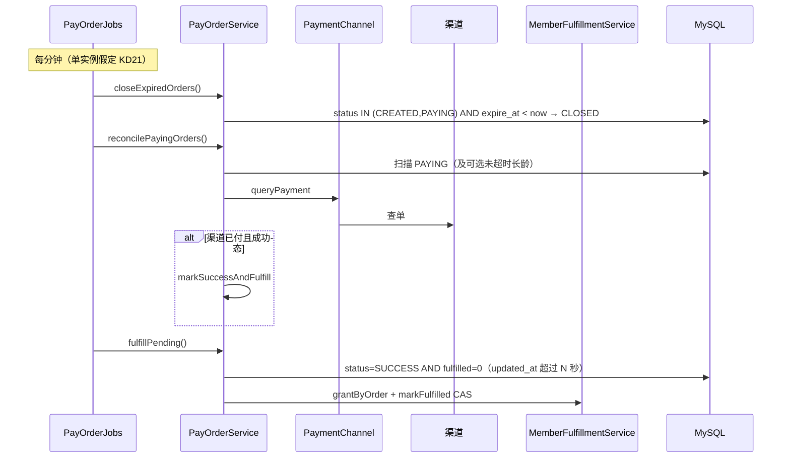
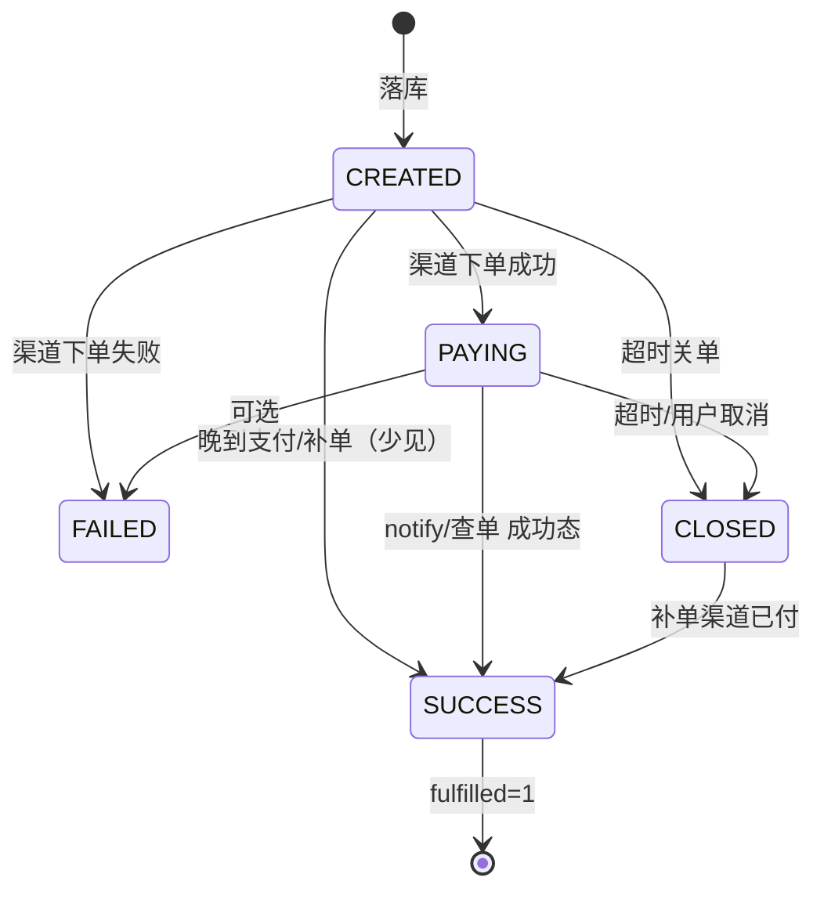
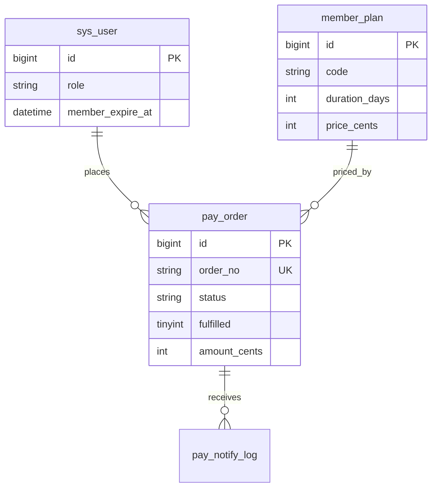

# 会员充值与支付宝/微信支付对接架构设计方案

**模块名称**：Member Pay（会员充值 / 支付通道）  
**后端包（拟）**：`com.dwcode.okxbot.pay` + `com.dwcode.okxbot.member`  
**后端**：`okx-bot`（Spring Boot 3.2 + MyBatis-Plus + MySQL + Spring Security 6 + JWT）  
**前端（拟）**：`okx-trading-web` 路由 `/member`、`/member/recharge`  
**文档版本**：v1.2（产品决议：SKU 定价、Mock 优先、SUPER_ADMIN 禁止购买）  
**状态**：Draft  
**作者**：架构组  
**日期**：2026-07-17  

**变更摘要（v1.2）**

| 项 | 内容 |
|----|------|
| SKU 定价 | 月卡 ¥29 / 季卡 ¥79 / 年卡 ¥199（与 DDL 种子一致，Q3 已决议） |
| 通道节奏 | Phase 0 = Mock 全链路（PR1–PR4）；真支付宝/微信待商户资质后做 PR5/PR6（Q2 已决议） |
| SUPER_ADMIN | **禁止**自助下单购买会员；创建订单直接业务拒绝（Q1 已决议） |

> **关联文档与代码**  
> - 认证：`okx-bot/doc/Auth_登录架构与安全设计.md`  
> - 角色枚举：`com.dwcode.okxbot.auth.enums.UserRole`（`USER` / `MEMBER` / `SUPER_ADMIN`）  
> - 安全配置：`com.dwcode.okxbot.auth.config.SecurityConfig`  
> - 全局异常：`com.dwcode.okxbot.common.exception.GlobalExceptionHandler`（notify **不得**依赖其 `ApiResult` 包装）  
> - 用户实体：`com.dwcode.okxbot.auth.entity.SysUserEntity`（尚无 `member_expire_at`）  
> - JWT：`JwtService` claims 仅 `sub`=userId + `email`（**不含 role**，每次请求 `CustomUserDetailsService.loadById` 读库）  
> - 前端：`okx-trading-web/src/stores/auth.store.ts`（已有 `isMember` 计算属性，当前仅看 role 字符串）  
> - 文档风格参考：`AI文生图_架构设计方案.md`  
> - SQL 草案落地位置：`okx-bot/doc/sql/member_pay.sql`（实现时写入）  

---

## 目录

1. [Overview](#1-overview)
2. [Background & Motivation](#2-background--motivation)
3. [Goals & Non-Goals](#3-goals--non-goals)
4. [Key Decisions](#4-key-decisions)
5. [与现有模块的关系](#5-与现有模块的关系)
6. [前置条件（商户资质）](#6-前置条件商户资质)
7. [Proposed Design](#7-proposed-design)
8. [API / Interface Changes](#8-api--interface-changes)
9. [Data Model Changes](#9-data-model-changes)
10. [后端包结构与核心接口](#10-后端包结构与核心接口)
11. [前端设计](#11-前端设计)
12. [配置项](#12-配置项)
13. [Security & Privacy](#13-security--privacy)
14. [Observability](#14-observability)
15. [Alternatives Considered](#15-alternatives-considered)
16. [分阶段落地计划](#16-分阶段落地计划)
17. [验收标准](#17-验收标准)
18. [风险与对策](#18-风险与对策)
19. [Rollout Plan](#19-rollout-plan)
20. [PR Plan](#20-pr-plan)
21. [Open Questions](#21-open-questions)
22. [References](#22-references)
23. [附录 A：完整 DDL 草案](#附录-a完整-ddl-草案)
24. [附录 B：SDK 与 Maven 依赖建议](#附录-b-sdk-与-maven-依赖建议)
25. [附录 C：渠道矩阵与 Notify 协议速查](#附录-c渠道矩阵与-notify-协议速查)
26. [附录 D：支付上线门禁（Phase 1）](#附录-d支付上线门禁phase-1)

---

## 1. Overview

当前 `okx-bot` 已具备完整邮箱注册登录与三角色模型（`USER` → `MEMBER` → `SUPER_ADMIN`），但 **MEMBER 仅为预留角色**：无支付模块、无订单表、无会员有效期字段，前后端权限上 USER/MEMBER 几乎无差异（见 `Auth_登录架构与安全设计.md` §4.1.1、`auth_role_migration.sql` 注释「会员 MEMBER 由后续充值流程升级（本次不实现）」）。

本方案按国内 SaaS / 内容产品主流做法，落地 **自建订单 + 直连支付宝/微信**（真通道待商户进件；**当前实现优先 Mock**）：用户选择可配置会员套餐（月卡 ¥29 / 季卡 ¥79 / 年卡 ¥199）→ 创建商户订单 → 调渠道下单拿到二维码/跳转链 → 用户支付 → **异步 notify 验签** → 订单置 SUCCESS 并 **同一事务内开通/续费会员**（`role=MEMBER` + `member_expire_at` 原子叠加）。过期通过 **定时任务 + `me()` 惰性降级** 回落为 `USER`。`SUPER_ADMIN` **不受过期降级影响**，且 **禁止通过充值下单购买会员**（特权与付费路径隔离）。

**主路径优先 Web SPA 场景**：实现期 **Mock 扫码/确认** 闭环；商户资质就绪后 PC **微信 Native + 支付宝 precreate**，移动 **微信 H5 / 支付宝 WAP**。聚合支付（Ping++ / 易宝 / 虎皮椒）作为备选对比，不作为 V1 主方案。

---

## 2. Background & Motivation

### 2.1 当前状态（代码核实）

| 项 | 现状 | 证据 |
|----|------|------|
| 角色枚举 | `USER` / `MEMBER` / `SUPER_ADMIN` | `UserRole.java` |
| 注册默认角色 | `USER`；注释写明会员靠充值升级 | `AuthService.register` L59–60 |
| `sys_user.role` | 已有；**无** `member_expire_at` | `SysUserEntity`、`auth_tables.sql`、`schema.sql` |
| 支付/订单 | **不存在** | 全仓无 `pay`/`member_plan`/`pay_order` 包与表 |
| Security | 除登录注册找回密码外 `/api/**` 需 JWT；`/api/admin/**` 仅 SUPER_ADMIN | `SecurityConfig` |
| JWT claims | 仅 `sub` + `email`，**不含 role / expire** | `JwtService.generateToken` |
| 鉴权角色来源 | 每请求按 userId **读库** 构造 `AuthUserPrincipal` | `JwtAuthFilter` + `CustomUserDetailsService.loadById` |
| 前端角色 | `isMember = role===MEMBER \|\| SUPER_ADMIN`；无到期展示 | `auth.store.ts` |
| 调度能力 | 应用已 `@EnableScheduling` | `OkxBotApplication` |
| 统一响应/异常 | `ApiResult` / `BusinessException`；全局 Advice 包装所有异常为 JSON | `GlobalExceptionHandler` |
| Adapter 惯例 | imggen/aigen 已用 Port + Adapter | 可复用设计模式 |
| 用户响应映射 | `AuthService` 与 `AdminUserService` **各有一套** toResponse | 扩展字段须两端同步或抽公共 mapper |

### 2.2 痛点

1. **商业闭环缺失**：AI 工具台已上线，但无法通过付费区分免费用户与会员。  
2. **角色语义悬空**：`MEMBER` 已在库表、枚举、前端标签中出现，却无升级/降级路径。  
3. **配额差异难落地**：功能拓展文档已提出 USER/MEMBER 配额差异，依赖「是否有效会员」判定。  
4. **支付合规与幂等**：直连渠道必须自建订单状态机、验签、金额校验与防重复开通，不可信任前端金额。

### 2.3 目标用户场景

```
登录用户 → 会员中心查看到期时间
        → 选月卡/季卡/年卡
        → 选微信支付 / 支付宝
        → PC 扫码（或 H5 跳转）支付
        → 前端轮询订单 SUCCESS
        → fetchMe() 刷新 role + memberExpireAt + memberActive
        → 会员权益生效（Phase 3 起做配额差异）
```

---

## 3. Goals & Non-Goals

### 3.1 Goals（V1–V2 必达）

| # | 目标 |
|---|------|
| G1 | 可配置会员套餐（月/季/年等），金额以服务端 `member_plan` 为准 |
| G2 | 自建支付订单 + 状态机；支持支付宝、微信至少一种真通道 + Mock 通道 |
| G3 | 支付成功后：`USER→MEMBER`（或续费叠加 `member_expire_at`）；**订单级 + 用户级**幂等履约 |
| G4 | 过期自动回落 `USER`（定时 + `me()` 惰性）；`SUPER_ADMIN` 永不因过期降级 |
| G5 | 异步 notify 免 JWT 但验签；查单补单；超时关单；**SUCCESS+未履约补偿** |
| G6 | 前端充值页：套餐 → 渠道 → 二维码/跳转 → 轮询 → 刷新用户信息 |
| G7 | 管理端：套餐 CRUD、订单查询（SUPER_ADMIN） |
| G8 | `/api/auth/me`（及 login/register 同一 `AuthUserResponse`）扩展会员字段 |

### 3.2 Non-Goals（V1 明确不做）

| # | 非目标 | 说明 |
|---|--------|------|
| N1 | 自动续费 / 签约代扣 | V1 仅 **一次性购买时长** |
| N2 | 用户自助退款全链路 | V1 **运维手工**（商户平台退款 + 管理端改 expire/role）；**不做自动扣回天数** |
| N3 | 预存款余额 / 积分钱包 | 直购会员时长 |
| N4 | 发票、分账、跨境收款 | 超出范围 |
| N5 | 支付独立微服务 | 同进程独立包 |
| N6 | Phase 0–2 强制业务配额差异 | Phase 3 |
| N7 | 小程序/APP 原生支付 | Web SPA only |
| N8 | 会员授予事件溯源账本表 | V1 用标量 `member_expire_at` + 用户行锁；账本为后续可选（见 §15.5） |

### 3.3 设计原则

| 原则 | 落地 |
|------|------|
| 复用优先 | JWT、`ApiResult`、`BusinessException`、雪花 ID、`SecurityUtils`、admin 模式 |
| 金额服务端权威 | 只传 `planId` + `channel`；价格/天数快照进订单 |
| 渠道可插拔 | `PaymentChannel` + Alipay / Wechat / Mock |
| 履约边界 | 仅 `MemberFulfillmentService` 写 `sys_user.role` / `member_expire_at` |
| 有效会员判定唯一入口 | **仅** `MemberStatusService.isActive(...)`，禁止单独 `role==MEMBER` |
| 幂等与安全 | 订单 CAS、`fulfilled` CAS、用户行锁/原子 SQL、notify 验签+交易态+金额分 |
| 可观测 | `pay_notify_log`、关单/补单/未履约补偿 Job、`orderNo` 全链路日志 |

---

## 4. Key Decisions

| # | 决策 | Rationale |
|---|------|-----------|
| KD1 | **主方案：自建订单 + 直连支付宝/微信**；聚合支付仅备选 | 国内 SaaS 主流可控；费率透明；与单体契合。 |
| KD2 | **可配置套餐 + 一次性购买时长**，非代扣、非余额 | 心智清晰；续费=新订单叠加有效期。 |
| KD3 | **`sys_user.member_expire_at` 标量**；有效会员见 KD20 | V1 简单够用；账本表非必须（§15.5）。 |
| KD4 | **开通**：写 `MEMBER` + 延长 expire；**过期**：写回 `USER`，**保留** `member_expire_at` 只读展示「已于 xxx 过期」 | 与枚举兼容；不清空便于客服。 |
| KD5 | **SUPER_ADMIN：不受过期降级；且禁止自助购买会员**（`POST /api/pay/orders` 直接拒绝） | 超管权限走 `hasRole('SUPER_ADMIN')`，与付费 MEMBER 路径隔离；避免无意义下单与 expire 语义混淆（产品决议 2026-07-17）。 |
| KD6 | **JWT 不写 role / expire** | 现网已读库；开通无需 re-login；避免最长 2h 滞后。 |
| KD7 | **`/api/auth/me` 扩展** `memberExpireAt`、`memberActive`；可选 `/api/member/status` 别名 | 复用 `fetchMe()`；login/register 共用 `toAuthUserResponse` 自动带上新字段。 |
| KD8 | API：`/api/pay/**`、`/api/member/**`；管理 `/api/admin/**`；**notify/return permitAll** | 与现网一致；回调公网免 JWT。 |
| KD9 | 包：`pay` + `member` | 通道与会员域解耦。 |
| KD10 | PC：微信 Native + 支付宝 precreate；移动：微信 H5 + 支付宝 WAP | 匹配 SPA；JSAPI 需 openid，V1 不做。 |
| KD11 | 状态机：`CREATED → PAYING → SUCCESS \| CLOSED \| FAILED`；SUCCESS 后履约 | 主流五态。 |
| KD12 | **库内金额单位：整型分**；渠道解析后统一为分再比对 | 微信原生分；支付宝元字符串须规范化（§7.7）。 |
| KD13 | 过期：定时 Job（主）+ **`me()` 惰性降级写库**（辅） | 读路径对用户立即一致；`loadById` 不写库。 |
| KD14 | **退款 V1：运维-only**——商户后台退款 + 管理端 **手工设定** `member_expire_at`/`role`；**禁止**自动 `expire - duration_days` | 多单叠加下减法算法错误（§13.4）。 |
| KD15 | Mock 通道：`pay.mock-enabled=true` 仅非生产；**启动断言**生产为 false；**当前实施优先 Mock（PR1–PR4），真通道 PR5/PR6 待商户资质** | 无进件即可交付会员闭环（产品决议 2026-07-17）。 |
| KD16 | **创建订单规则（唯一）**：(0) **SUPER_ADMIN → 400 拒绝购买**；(1) 同 user+plan+channel 未过期未终态 → **幂等返回该订单**；(2) open 数 ≥ max → `400`；(3) 否则新建 | 产品禁止超管购买；并消除「返回旧单 vs 报错」歧义。 |
| KD23 | **默认 SKU 定价**：月卡 30 天 **¥29.00（2900 分）** / 季卡 90 天 **¥79.00（7900 分）** / 年卡 365 天 **¥199.00（19900 分）** | 与 DDL 种子一致；后续可经管理端改价（产品决议 2026-07-17）。 |
| KD17 | 回调 body **渠道协议原文**，永不包 `ApiResult`；notify 内 **catch 全部异常** 写协议失败体 | 对接 `GlobalExceptionHandler` 风险（§8.5、§10.3）。 |
| KD18 | **SUCCESS 与履约同事务**；失败则整单回滚（保持可重试态）；另设 **`SUCCESS AND fulfilled=0` 补偿 Job** 作安全网 | 防「已付未开会员」。 |
| KD19 | **叠加有效期必须用户级并发安全**：`SELECT … FOR UPDATE` 或单条原子 `UPDATE … DATE_ADD(GREATEST(...))`；禁止无锁 RMW | 多订单并发履约不丢天数。 |
| KD20 | **权益判定唯一 API**：`MemberStatusService.isActive(user)`；**禁止**仅用 `role==MEMBER` 或 `@PreAuthorize("hasRole('MEMBER')")` 作为权益门闸 | 过期窗口内 role 可能仍为 MEMBER。 |
| KD21 | **调度 V1 假定单实例**（与现网一致）；多实例需 ShedLock/DB 租约后再扩 | 现网无分布式锁；CAS 缓订单双成功，用户扩展靠 KD19。 |
| KD22 | **仅交易成功态入履约**：支付宝 `TRADE_SUCCESS`/`TRADE_FINISHED`；微信 `trade_state=SUCCESS` | 忽略 WAIT_BUYER_PAY / NOTPAY 等。 |

---

## 5. 与现有模块的关系

### 5.1 架构位置

```
                    ┌──────────────────────────────────────┐
                    │           可复用（共享能力）            │
                    │  JWT / SecurityConfig / SecurityUtils │
                    │  ApiResult / BusinessException        │
                    │  MyBatis-Plus 雪花 ID / sys_user       │
                    │  @EnableScheduling / 管理端 SUPER_ADMIN│
                    └──────────────────────────────────────┘
                                      │
          ┌───────────────────────────┼───────────────────────────┐
          ▼                           ▼                           ▼
┌──────────────────┐     ┌──────────────────┐     ┌──────────────────┐
│ auth（已有）       │     │ member + pay（新） │     │ video/aigen/imggen│
│ 登录注册 JWT       │◄────│ 套餐/订单/履约     │────►│ Phase3 读 isActive│
│ role / 用户管理    │     │ 支付宝/微信/Mock   │     │ 配额差异（可选）   │
└──────────────────┘     └──────────────────┘     └──────────────────┘
```

### 5.2 与 auth 的边界

| 职责 | 归属 |
|------|------|
| 注册/登录/JWT/禁用账号 | `auth` 不变 |
| 组装 `memberExpireAt` / `memberActive` | `AuthService.toAuthUserResponse` + **`AdminUserService` 同源映射**（抽 `AuthUserMapper`/`MemberStatusService.fill`） |
| **`me()` 惰性降级** | 调用 `MemberStatusService.demoteIfExpired(userId)` 后再读 |
| **写** role/expire（开通） | **仅** `MemberFulfillmentService` |
| **写** role/expire（运维延期/人工开通） | `Admin` + `MemberFulfillmentService` 运维方法 |
| 支付下单/回调/查单 | `pay` |

**禁止**：支付 Adapter 直接改 `SysUser`；业务代码用 `principal.getRole()==MEMBER` 判断权益。

### 5.3 SecurityConfig 变更点

matcher **顺序**（须在 `anyRequest().authenticated()` **之前**）：

```java
// 1) 支付异步回调 / 同步回跳：渠道无 JWT
.requestMatchers(
    "/api/pay/notify/**",
    "/api/pay/return/**"
).permitAll()
// 2) 其余 /api/pay/**、/api/member/** → authenticated（落在 anyRequest）
// 3) /api/admin/** 已有 hasRole SUPER_ADMIN
```

**操作说明**（与现网过滤器行为一致）：

| 项 | 结论 |
|----|------|
| `JwtAuthFilter` | 无 Bearer **不拒绝**，只跳过写 Context；故 notify 匿名可用 |
| `/api/pay/mock/confirm` | **必须 authenticated**，且服务端校验 `pay.mock-enabled=true`；**不得** permitAll |
| 生产启动 | `PayProperties` 校验：`!mock-enabled` 或直接 fail-fast |
| CSRF | 维持全局 disable（JWT SPA + 服务端 notify） |
| 请求体 | 现网无消费 body 的 Filter；notify 用 `@RequestBody String` 或 `getInputStream()` 读 **原始 body**（微信验签依赖原文） |

PR5 验收须钉死上述 matcher 片段与 mock 鉴权规则。

### 5.4 JWT / UserRole / 有效会员（落实 KD6、KD20）

| 问题 | 结论 |
|------|------|
| JWT 是否带 `role` / `memberExpireAt`？ | **否** |
| 开通后是否 re-login？ | **否**；下次请求读库 |
| 前端刷新 | 支付成功后 `auth.fetchMe()`（login/register 响应已含新字段） |
| 权益判断 | **仅** `MemberStatusService.isActive` |
| `hasRole('MEMBER')` | V1 **禁止**用作权益门闸 |
| `AuthUserPrincipal` 加 expire？ | V1 可不加；Phase 3 若方法级鉴权再扩展 |
| 过期一致性 | **`me()` 写降级**（优先）；Job 兜底；`loadById` 只读不降级 |
| 读路径在降级前 | `isActive` 即使 role 仍为 MEMBER 也返回 false（若 expire≤now）——但 `me()` 会先 demote 再返回，前后端看到 role=USER |

**`MemberStatusService` 规范 API**：

```java
/** 唯一权益判定：SUPER_ADMIN → true；否则 MEMBER 且 memberExpireAt > now */
public static boolean isActive(String role, LocalDateTime memberExpireAt, LocalDateTime now);

public boolean isActive(SysUserEntity user);

/** me()/权益点：若 MEMBER 且已过期 → role=USER（保留 expire）；SUPER_ADMIN 跳过 */
public void demoteIfExpired(Long userId);

/** Phase 3：非有效会员抛 BusinessException */
public void requireActiveMember(Long userId);
```

---

## 6. 前置条件（商户资质）

> 上线真实收款的 **非代码** 前提。

| 项 | 支付宝 | 微信支付 |
|----|--------|----------|
| 主体 | 企业/个体工商户营业执照 | 同左；部分产品需企业 |
| 平台入驻 | 支付宝开放平台应用 | 微信商户平台 + 开放平台 |
| 产品开通 | 当面付 / 手机网站 / 电脑网站 | Native / H5 等 |
| 网站 | 备案域名；生产 **HTTPS** | 同左；H5 绑定支付域名 |
| 密钥 | 应用私钥 + 支付宝公钥（或证书） | APIv3 商户私钥 + 平台证书；`mchId`/`apiV3Key` |
| 回调 | 公网 `notify_url` | 同左 |

**开发期**：沙箱或 **Mock**。Phase 1 真收款前须过 [附录 D 门禁](#附录-d支付上线门禁phase-1)。

---

## 7. Proposed Design

### 7.1 总体架构



### 7.2 核心时序：创建订单 → 支付 → 回调 → 开通会员



### 7.3 查单补单、超时关单、未履约补偿



**规则要点**：

1. **履约入口唯一**：`PayOrderService.markSuccessAndFulfill`（notify / 查单 / Mock confirm 共用）。  
2. **同步 return 不履约**。  
3. **关单范围**：`status IN ('CREATED','PAYING') AND expire_at < now`（**含 CREATED**，避免渠道创建失败卡死占 open 配额）。  
4. **CLOSED→SUCCESS**：补单发现渠道已付则允许受控复活。  
5. **SUCCESS + fulfilled=0**：`fulfillPending` 强制补偿；告警日志。  
6. **同事务**：CAS SUCCESS + grant + fulfilled=1 失败则 **整事务回滚**（订单保持可重试态：通常仍为 PAYING/CLOSED，由渠道重试 notify 或 reconcile 再入）；**禁止**先提交 SUCCESS 再另事务 grant 且无补偿。  
7. **调度**：V1 单实例；多实例需分布式锁（§18）。

### 7.4 订单状态机



| 状态 | 含义 | 可转出 |
|------|------|--------|
| `CREATED` | 本地已建，未拿到渠道凭证 | PAYING / FAILED / CLOSED / SUCCESS |
| `PAYING` | 已返回支付凭证 | SUCCESS / CLOSED / FAILED |
| `SUCCESS` | 已支付且金额/商户/交易态校验通过 | 终态（`fulfilled` 可 0→1） |
| `CLOSED` | 超时或取消 | 仅补单 → SUCCESS |
| `FAILED` | 下单失败 | 终态 |

```sql
-- 入 SUCCESS
UPDATE pay_order SET status='SUCCESS', trade_no=?, paid_at=NOW(3), updated_at=NOW(3)
WHERE order_no=? AND status IN ('CREATED','PAYING','CLOSED');

-- 履约标记
UPDATE pay_order SET fulfilled=1, updated_at=NOW(3)
WHERE order_no=? AND fulfilled=0;
```

### 7.5 会员有效期算法与并发

**算法（语义）**：

```
base = max(now, user.member_expire_at)   -- 未过期叠加；已过期从 now
new_expire = base + duration_days        -- LocalDateTime.plusDays，时区 Asia/Shanghai
SUPER_ADMIN: **不会进入本算法**（创建订单已拒绝；履约路径若误触则跳过改 role，且不应产生超管付费单）
USER/MEMBER: role=MEMBER, member_expire_at=new_expire
过期降级: role=USER，**保留** member_expire_at（不处理 SUPER_ADMIN）
```

**并发（强制，KD19）——禁止无锁 read-modify-write**：

**方案 A（推荐，MySQL）同一事务**：

```sql
SELECT id, role, member_expire_at FROM sys_user WHERE id=? FOR UPDATE;
-- 计算 base/new_expire 后
UPDATE sys_user SET member_expire_at=?, role=IF(role='SUPER_ADMIN', role, 'MEMBER'), updated_at=NOW(3)
WHERE id=?;
```

**方案 B（单 SQL 原子延长，等价）**：

```sql
UPDATE sys_user
SET member_expire_at = DATE_ADD(
      GREATEST(COALESCE(member_expire_at, NOW(3)), NOW(3)),
      INTERVAL #{days} DAY
    ),
    role = IF(role = 'SUPER_ADMIN', role, 'MEMBER'),
    updated_at = NOW(3)
WHERE id = #{userId};
```

两单并发履约时，行锁/原子更新保证 **总延长 = sum(duration_days)**，不丢天。

**可选增强（非 V1 必须）**：`member_grant_log(order_no UK, user_id, days, before_expire, after_expire)` 便于审计；退款重算仍复杂，见 §15.5。

**惰性降级**：

| 触发点 | 行为 |
|--------|------|
| `AuthService.me()` | `demoteIfExpired` **写库**后返回 |
| `GET /api/member/status` | 同 me |
| Phase 3 权益入口 | `requireActiveMember`（内部 isActive + 可选 demote） |
| `loadById` / 每个 API | **不写**降级 |
| `MemberExpireJob` | 批量 `role=MEMBER AND member_expire_at<=now` → USER |

### 7.6 渠道适配：PaymentChannel

```java
public interface PaymentChannel {
    String channelId(); // alipay | wechat | mock

    PaymentCreateResult createPayment(PayOrderEntity order, PayCreateContext ctx);

    /**
     * 验签（微信：含平台证书 + AES-GCM 解密 resource）后解析为统一结构。
     * amountCents 必须为「分」。
     * paid == true 仅当渠道交易成功态（KD22）。
     */
    NotifyParseResult parseAndVerifyNotify(HttpHeaders headers, String rawBody);

    ChannelTradeQueryResult queryPayment(PayOrderEntity order);
}
```

```java
public class NotifyParseResult {
    boolean signatureValid;
    boolean paid;              // 仅成功态 true
    String orderNo;            // out_trade_no
    String tradeNo;            // 渠道交易号
    long amountCents;          // 统一为分
    String appIdOrMchIdHint;   // 供校验
    String rawTradeState;      // 审计
}
```

#### 7.6.1 WechatChannel（APIv3 要点）

1. **验签头**：`Wechatpay-Timestamp`、`Wechatpay-Nonce`、`Wechatpay-Signature`、`Wechatpay-Serial`。  
2. **验签材料**：微信支付平台证书（或公钥模式）；`wechatpay-java` **自动更新平台证书** 为推荐做法。  
3. **解密**：通知 body JSON 中 `resource`：`algorithm`（AEAD_AES_256_GCM）、`ciphertext`、`nonce`、`associated_data`；用 **`apiV3Key`** AES-GCM 解密得明文 JSON。  
4. **明文关键字段**：`out_trade_no`、`transaction_id`、`trade_state`、`amount.total`（**整数分**）、`appid`/`mchid`。  
5. **入履约条件**：`trade_state == "SUCCESS"`（及金额、mch 匹配）。`NOTPAY`/`CLOSED`/`REFUND` 等 → `paid=false`，`process_result=IGNORED`。  
6. **查单**：`GET /v3/pay/transactions/out-trade-no/{out_trade_no}`，同样检查 `trade_state` 与金额。  
7. **H5**：下单需 `scene_info.payer_client_ip`；IP 取自受信代理头策略（见附录 C）。

#### 7.6.2 AlipayChannel 要点

1. **PC 扫码**：`alipay.trade.precreate` → `qr_code`。  
2. **H5/手机网站**：`alipay.trade.wap.pay` 返回 form/跳转 URL。  
3. **可选 PC 页面**：`alipay.trade.page.pay`（本项目 SPA 优先 precreate 扫码）。  
4. **Notify**：`application/x-www-form-urlencoded` 表单；RSA2 验签。  
5. **金额**：`total_amount` 为 **元字符串**（如 `"29.00"`）→ 转为分，见 §7.7。  
6. **入履约条件**：`trade_status` ∈ {`TRADE_SUCCESS`,`TRADE_FINISHED`}。`WAIT_BUYER_PAY`/`TRADE_CLOSED` → 不履约。

#### 7.6.3 MockPaymentChannel

- 返回假 `code_url`；**仅** `POST /api/pay/mock/confirm`（登录 + mock-enabled）触发 `markSuccessAndFulfill`。  
- 不走公网 notify（故 PR3 可不改 permitAll；真通道 PR5 再放行）。

**创建上下文 `PayCreateContext`**：`clientType`、`clientIp`、`notifyAbsoluteUrl`、`returnAbsoluteUrl`。

### 7.7 幂等、金额与交易态校验清单

| 校验项 | 说明 |
|--------|------|
| 签名/解密 | 失败 → 记 log，返回渠道 **fail** 体（促使重试或告警）；不抛到全局 Advice |
| 交易成功态 | KD22；非成功 → IGNORED + **验签通过时仍 ACK success**（避免无意义重试），不改订单为 SUCCESS |
| 商户订单号 | 必须命中本地订单 |
| **金额（分）** | `NotifyParseResult.amountCents == pay_order.amount_cents` |
| appId / mchId | 与配置一致 |
| 状态幂等 | 已 SUCCESS → ACK，不二次履约（`fulfilled` 已 1） |
| 履约幂等 | `fulfilled` CAS；用户延长靠行锁 |
| 重放 | 验签 + 状态机 |

**金额规范化（强制）**：

| 渠道 | 原始字段 | 转为 `amountCents` |
|------|----------|---------------------|
| 微信 | `amount.total`（int 分） | 直接使用 |
| 支付宝 | `total_amount`（元，字符串） | `new BigDecimal(s).movePointRight(2).longValueExact()`；拒绝非 2 位小数或科学计数 |
| Mock | 本地订单金额 | 与订单一致 |

单元测试：`2900 ↔ "29.00"`；拒绝 `"29.0"` / `"29"` / float 直转。

### 7.8 商户订单号生成

`P` + `yyyyMMddHHmmss` + 数字后缀，总长 ≤32。示例：`P202607171530221234567890`。  
主键 `id` 仍为雪花；`order_no` 业务可见并写入创建响应（客服工单必带）。

### 7.9 创建订单（KD16 精确语义）

```
0. 若当前用户 role == SUPER_ADMIN
     → BusinessException 400「超级管理员无需购买会员」
     → 不建单、不调渠道（Mock / 支付宝 / 微信均适用）

open = status IN (CREATED, PAYING) AND expire_at > now

1. 若存在 open 且 user_id+plan_id+channel 相同
     → 直接返回该订单支付凭证（HTTP 200，同一 orderNo）；不新建
2. 否则若 count(open by user) >= max-open-orders-per-user
     → BusinessException 400「您有未完成的支付订单，请先完成或等待超时」
3. 否则 INSERT CREATED → 渠道下单 → PAYING
```

前端：超管进入充值页应隐藏下单或提示「超管无需购买」；重复点击「支付」对普通用户应稳定展示同一二维码，而非报错刷屏。

---

## 8. API / Interface Changes

统一响应（**业务 API**）：`ApiResult<T>`。  
**Notify / Return**：**非** `ApiResult`，见 §8.5。

### 8.1 用户侧 — 套餐与会员状态

| 方法 | 路径 | 鉴权 | 说明 |
|------|------|------|------|
| GET | `/api/member/plans` | 登录 | 上架套餐 |
| GET | `/api/member/status` | 登录 | 先 demoteIfExpired，再返回状态 |
| GET | `/api/auth/me` | 登录 | 同上 + 用户资料 |

**`AuthUserResponse` / 前端 `AuthUser` 扩展**：

```java
private LocalDateTime memberExpireAt;
/** MemberStatusService.isActive 结果（me 时已尽量 demote） */
private Boolean memberActive;
```

**注意**：`login` / `register` 经同一 `toAuthUserResponse`，新字段自动出现，前端类型一次改全。

### 8.2 用户侧 — 支付订单

| 方法 | 路径 | 鉴权 | 说明 |
|------|------|------|------|
| POST | `/api/pay/orders` | 登录 | 创建或幂等返回（KD16）；**SUPER_ADMIN → 400**；`pay.enabled=false` 时 **503** |
| GET | `/api/pay/orders/{orderNo}` | 登录 | 本人订单 |
| GET | `/api/pay/orders` | 登录 | 我的订单分页（可选） |
| POST | `/api/pay/orders/{orderNo}/cancel` | 登录 | 未支付 → CLOSED（可选） |
| POST | `/api/pay/notify/alipay` | **匿名** | 协议 body |
| POST | `/api/pay/notify/wechat` | **匿名** | 协议 body |
| GET/POST | `/api/pay/return/**` | **匿名** | 仅引导页/JSON 提示，不履约 |
| POST | `/api/pay/mock/confirm` | **登录** + mock-enabled | body: `{ "orderNo": "..." }` |

**创建请求**：

```json
{ "planId": "2078000000000000001", "channel": "wechat", "clientType": "PC" }
```

**创建响应**（务必返回 `orderNo` 供展示与工单）：

```json
{
  "code": 0,
  "data": {
    "orderNo": "P202607171530221234567890",
    "channel": "wechat",
    "status": "PAYING",
    "amountCents": 2900,
    "amountYuan": "29.00",
    "planName": "月卡",
    "payMode": "NATIVE_QR",
    "qrCodeUrl": "weixin://wxpay/bizpayurl?pr=xxxx",
    "payUrl": null,
    "expireAt": "2026-07-17 16:00:00",
    "idempotentReuse": false
  }
}
```

### 8.3 管理端

| 方法 | 路径 | 鉴权 | 说明 |
|------|------|------|------|
| GET/POST | `/api/admin/member-plans` | SUPER_ADMIN | 列表/创建；校验 price_cents>0、duration_days>0 |
| PUT | `/api/admin/member-plans/{id}` | SUPER_ADMIN | 改价/上下架/排序 |
| GET | `/api/admin/pay-orders` | SUPER_ADMIN | 订单分页 |
| GET | `/api/admin/pay-orders/{orderNo}` | SUPER_ADMIN | 详情 + 回调摘要 |
| POST | `/api/admin/users/{id}/member` | SUPER_ADMIN | **人工设定** expire/role（运维延期/开通/关闭） |
| POST | `/api/admin/pay-orders/{orderNo}/mark-refunded` | SUPER_ADMIN | **仅标记**本地 refund_status；**不**自动扣天数；可选备注 |

> V1 **不提供**自动调渠道退款 + 自动 clawback 的组合 API；渠道退款在商户后台完成。

### 8.4 与现有接口对比

| 接口 | Before | After |
|------|--------|-------|
| login/register/me | 无会员字段 | + `memberExpireAt`, `memberActive` |
| Admin 用户列表 | 无到期 | + 字段；展示用 isActive 语义 |
| SecurityConfig | 仅 auth 公开 | + notify/return permitAll |

### 8.5 Notify 响应契约（对接 GlobalExceptionHandler）

现网 `GlobalExceptionHandler` 会把任意 `BusinessException`/`Exception` 写成 `ApiResult` JSON。渠道 **不认** 该格式。

**强制实现**：

1. `PayNotifyController` 每个方法：
   - 读取 **原始** body；
   - `try { ... } catch (Throwable t) { log; insert pay_notify_log FAIL; return failBody; }`；
   - **禁止**向过滤器链抛出业务异常。  
2. 返回类型：`ResponseEntity<String>`（或 `void` + `HttpServletResponse` 写字节），`Content-Type` 按渠道。  
3. 可选：将 Advice 收窄为 `assignableTypes` 排除 notify Controller；**仍以 controller catch 为准**（双保险）。

| 渠道 | 成功 body | 失败 body | Content-Type |
|------|-----------|-----------|--------------|
| 支付宝 | 纯文本 `success` | 纯文本 `failure` | `text/plain` |
| 微信 APIv3 | `{"code":"SUCCESS"}` | `{"code":"FAIL","message":"..."}` | `application/json` |
| Mock | 不适用（走业务 ApiResult） | — | — |

验签失败：返回 **fail**（让渠道重试/运营感知）；业务上已 SUCCESS 的重放：返回 **success**。

---

## 9. Data Model Changes

### 9.1 ER



### 9.2 `sys_user`

| 字段 | 类型 | 说明 |
|------|------|------|
| `member_expire_at` | `DATETIME(3) NULL` | 到期；过期后 **保留** |

| role | expire | `isActive` | 读路径动作 |
|------|--------|------------|------------|
| USER | 任意 | false | — |
| MEMBER | > now | true | — |
| MEMBER | ≤ now | false | `me()`/Job → 降为 USER，**保留 expire** |
| SUPER_ADMIN | 任意 | true | 永不因会员逻辑改 role |

**永远不要**把「role 字符串 == MEMBER」单独当作成权依据。

### 9.3 `member_plan`

字段同前：code/name/duration_days/price_cents/original/status/sort_order。  
**应用层校验**：`price_cents > 0`、`duration_days > 0`、code 唯一。MySQL 不强制 CHECK。

### 9.4 `pay_order`

关键字段：快照 plan_*、`amount_cents`、`status`、`fulfilled`、`trade_no`、`expire_at`、`refund_status`（标记用）等。

**索引**：

- `uk_order_no`
- `idx_user_created (user_id, created_at)`
- `idx_status_expire (status, expire_at)` — 关单
- `idx_status_fulfilled (status, fulfilled, updated_at)` — **未履约补偿**
- `idx_trade_no (trade_no)`
- **可选**：`uk_channel_trade (channel, trade_no)` 在业务保证 trade_no 非空时防渠道单号串单（MySQL 多 NULL 不冲突）

### 9.5 `pay_notify_log`

保留 verify_ok / process_result / body_raw（截断策略）等。

### 9.6 迁移

1. `member_pay.sql`：ALTER + 建表 + 种子（推荐 **应用启动种子** 用雪花 ID，SQL 固定 ID 仅文档演示）。  
2. 同步 `schema.sql`。  
3. 已有部署执行 ALTER；列可空，旧用户行为=非会员。

完整 DDL 见附录 A。

---

## 10. 后端包结构与核心接口

```
com.dwcode.okxbot
├── auth/          # AuthUserResponse/AuthService/AdminUserService 扩展；可选 AuthUserAssembler
├── member/
│   ├── service/
│   │   ├── MemberPlanService
│   │   ├── MemberFulfillmentService   # grant：FOR UPDATE / 原子 SQL
│   │   └── MemberStatusService        # isActive / demoteIfExpired / requireActiveMember
│   └── job/ MemberExpireJob
└── pay/
    ├── controller/ PayNotifyController  # 协议响应 + 全捕获
    ├── channel/ alipay|wechat|mock
    ├── service/ PayOrderService         # create / markSuccessAndFulfill
    └── job/ PayOrderJobs                # close / reconcile / fulfillPending
```

### 10.1 关键服务伪代码

```java
@Transactional
public void markSuccessAndFulfill(String orderNo, String tradeNo, long amountCentsFromChannel) {
    PayOrderEntity order = payOrderMapper.selectByOrderNo(orderNo);
    if (order == null) throw new PayNotifyIgnoreException("order missing");
    if (order.getAmountCents() != amountCentsFromChannel) throw new PayNotifyFailException("amount mismatch");

    if ("SUCCESS".equals(order.getStatus()) && order.getFulfilled() == 1) {
        return; // 幂等
    }

    if (!"SUCCESS".equals(order.getStatus())) {
        int n = payOrderMapper.casToSuccess(orderNo, tradeNo);
        if (n == 0 && !isAlreadySuccess(orderNo)) {
            throw new PayNotifyFailException("cas failed");
        }
    }

    // 与 SUCCESS 同事务：失败则回滚 SUCCESS
    int f = payOrderMapper.markFulfilledIfNot(orderNo);
    if (f == 1) {
        memberFulfillmentService.grantByOrder(order); // 内部锁用户行
    } else {
        // 已 fulfilled：幂等
    }
}

@Transactional
public void grantByOrder(PayOrderEntity order) {
    // 方案 A
    SysUserEntity user = sysUserMapper.selectByIdForUpdate(order.getUserId());
    if (user == null) throw new IllegalStateException("user missing");
    LocalDateTime now = LocalDateTime.now(ZoneId.of("Asia/Shanghai"));
    LocalDateTime base = user.getMemberExpireAt() != null && user.getMemberExpireAt().isAfter(now)
            ? user.getMemberExpireAt() : now;
    LocalDateTime neu = base.plusDays(order.getDurationDays());
    if (!UserRole.SUPER_ADMIN.name().equals(user.getRole())) {
        user.setRole(UserRole.MEMBER.name());
    }
    user.setMemberExpireAt(neu);
    user.setUpdatedAt(now);
    sysUserMapper.updateById(user);
    log.info("member granted orderNo={} userId={} expireAt={}", order.getOrderNo(), user.getId(), neu);
}
```

`fulfillPending`：

```java
// SELECT * FROM pay_order WHERE status='SUCCESS' AND fulfilled=0 AND updated_at < now - 30s LIMIT 100
// 每条：markFulfilledIfNot + grantByOrder（注意 grant 与 fulfilled 同事务；若 grant 抛错则 fulfilled 不置 1）
```

### 10.2 依赖方向

```
pay → member.MemberFulfillmentService
auth.AuthService / AdminUserService → member.MemberStatusService（isActive + demote）
pay ↛ SysUser 直写
```

为避免循环：`MemberStatusService` 不依赖 pay。

### 10.3 PayNotifyController 骨架

```java
@PostMapping(value = "/api/pay/notify/wechat", produces = MediaType.APPLICATION_JSON_VALUE)
public ResponseEntity<String> wechat(@RequestBody String raw, @RequestHeader HttpHeaders headers) {
    try {
        payNotifyService.handle("wechat", headers, raw);
        return ResponseEntity.ok("{\"code\":\"SUCCESS\"}");
    } catch (Exception e) {
        log.error("wechat notify error", e);
        return ResponseEntity.status(500)
            .body("{\"code\":\"FAIL\",\"message\":\"internal\"}");
    }
}
```

支付宝同理返回 `"success"` / `"failure"`。

---

## 11. 前端设计

### 11.1 路由

| path | meta | 说明 |
|------|------|------|
| `/member` | 登录 | 会员中心 |
| `/member/recharge` | 登录 | 充值 |
| 管理套餐/订单 | `requiresSuperAdmin` | 可选页 |

### 11.2 充值流程

```
plans → 选套餐/渠道 → POST orders（展示返回的 orderNo）
  → NATIVE_QR：二维码库渲染 qrCodeUrl（如 qrcode / ant-design 生态）
  → H5：location = payUrl
  → 轮询 1.5s；页面 hidden 时放缓至 5s；最长 5min
  → SUCCESS：fetchMe + 成功页展示到期时间与 orderNo
  → CLOSED/FAILED：引导重新下单
```

### 11.3 Store

```ts
// 与后端 isActive 对齐：不得只看 role===MEMBER
const isMemberActive = computed(() => {
  if (role.value === 'SUPER_ADMIN') return true
  // 优先信任服务端 memberActive（me 已 demote）
  if (user.value?.memberActive != null) return !!user.value.memberActive
  if (role.value !== 'MEMBER') return false
  const exp = user.value?.memberExpireAt
  return !!exp && new Date(exp).getTime() > Date.now()
})
const isMember = isMemberActive
```

### 11.4 权限

V1 不对工具路由 `requiresMember`；管理端仅超管。  
超管可见「会员中心」只读（或隐藏「立即开通」）；调用创建订单时展示后端错误文案「超级管理员无需购买会员」。

---

## 12. 配置项

```yaml
pay:
  enabled: true
  public-base-url: https://api.example.com
  order-expire-minutes: 30
  max-open-orders-per-user: 3
  reconcile-cron: "0 */1 * * * ?"
  close-cron: "0 */1 * * * ?"
  fulfill-pending-cron: "0 */1 * * * ?"
  fulfill-pending-grace-seconds: 30
  member-expire-cron: "0 5 * * * ?"
  mock-enabled: true                   # 生产启动失败若为 true
  # 可信代理：取 client IP 时是否信任 X-Forwarded-For 第一段
  trust-x-forwarded-for: false

  alipay:
    enabled: false
    app-id: ${ALIPAY_APP_ID:}
    private-key: ${ALIPAY_PRIVATE_KEY:}
    alipay-public-key: ${ALIPAY_PUBLIC_KEY:}
    sign-type: RSA2
    server-url: https://openapi.alipay.com/gateway.do
    notify-path: /api/pay/notify/alipay
    return-path: /api/pay/return/alipay

  wechat:
    enabled: false
    app-id: ${WECHAT_APP_ID:}
    mch-id: ${WECHAT_MCH_ID:}
    api-v3-key: ${WECHAT_API_V3_KEY:}
    merchant-serial-number: ${WECHAT_MCH_SERIAL:}
    private-key-path: ${WECHAT_PRIVATE_KEY_PATH:}
    notify-path: /api/pay/notify/wechat
```

| 环境 | mock | 真通道 | public-base-url |
|------|------|--------|-----------------|
| 本地 | true | off | localhost / 穿透 |
| 联调 | false | 沙箱 | HTTPS 穿透 |
| 生产 | **false** | on | 正式 HTTPS |

`pay.enabled=false`：支付 Controller 返回 **503**，前端隐藏入口。

---

## 13. Security & Privacy

### 13.1 威胁模型

| 威胁 | 严重度 | 缓解 |
|------|--------|------|
| 伪造回调 | 高 | 验签/解密、金额分、mch、成功态 |
| 改前端金额 | 高 | 只信 plan 快照 |
| 重放 | 中 | 状态机 + fulfilled |
| 越权查单 | 中 | user_id 隔离 |
| 密钥泄漏 | 高 | 仅 env |
| 刷单占坑 | 中 | KD16 + 含 CREATED 关单 |
| 超管降级 / 误购 | 高 | 过期跳过 SUPER_ADMIN；**创建订单拒绝超管购买** |
| Advice 污染 notify | 高 | §8.5 全捕获 |

### 13.2 实践

- 生产 mock 启动失败；日志禁密钥；管理写操作记 operatorId。

### 13.3 隐私

- 订单 PII 仅管理端；充值页协议链接占位。

### 13.4 退款策略（V1，修订）

| 项 | 策略 |
|----|------|
| 用户自助退款 | **不做** |
| 渠道退款 | **商户平台手工** |
| 会员权益 | **运维**调用 `POST /api/admin/users/{id}/member` **设定绝对** `member_expire_at` 与 role |
| 本地订单 | `mark-refunded` 仅改 `refund_status`，便于对账 |
| ~~自动 `expire - duration_days`~~ | **删除**；多单叠加/已消费时段下错误 |
| 账本重算 | 非 V1；见 Open Question Q9 |

---

## 14. Observability

### 14.1 日志

全链路 **`orderNo`**（创建响应、notify、履约、前端成功页展示）。  
字段：userId、channel、status、tradeNo、verifyOk、fulfilled、durationMs。

### 14.2 指标（可选 Micrometer）

created/success/notify_fail/reconcile_fix/fulfill_pending_total。

### 14.3 告警

验签连续失败、成功率骤降、`fulfillPending` 扫到积压、生产 mock=true。

### 14.4 对账

日导出 SUCCESS 与渠道账单按 `out_trade_no` 勾兑；差异走查单/人工。

---

## 15. Alternatives Considered

### 15.1 直连 vs 聚合支付

主选直连；聚合可作临时 `PaymentChannel` 实现而不改订单模型。

### 15.2 余额钱包 vs 直购时长

主选直购时长（合规与复杂度）。

### 15.3 订阅代扣 vs 一次性

主选一次性。

### 15.4 其他否决

无订单表、return 履约、JWT 内嵌 role —— 均否。

### 15.5 会员账本 / 事件溯源 vs 标量 expire（新增）

| 维度 | 标量 `member_expire_at`（V1 主选） | 授予账本 `member_grant_log` |
|------|-----------------------------------|-----------------------------|
| 实现 | 低 | 中高 |
| 并发 | 行锁/原子 SQL 即可 | 追加写入 + 重算 |
| 退款 | 难（故 V1 运维设绝对值） | 可标记 grant 作废后重算（已消费时段仍要产品规则） |
| 审计 | 订单表可追溯购买 | 更强 |

**结论**：V1 标量 + 强制锁；账本留 Phase 3+/退款自动化时再上。

### 15.6 Notify 线程同步履约 vs Outbox/MQ（新增）

| 维度 | 同步履约同事务（主选） | Outbox + 异步 Worker |
|------|------------------------|----------------------|
| 延迟 | 低，轮询快看到会员 | 多一跳 |
| 可靠 | 同事务 + fulfillPending 补偿足够低频场景 | 更高吞吐时更好 |
| 复杂度 | 低 | 需 outbox 表与消费者 |

**结论**：会员购买 QPS 低，同步 + 补偿 Job 足够。

---

## 16. 分阶段落地计划

> **实施优先级（产品决议 2026-07-17）**：**先完成 Phase 0 = PR1–PR4（Mock 全链路）**；**PR5/PR6 真支付宝/微信延后至商户资质（进件/密钥/HTTPS 回调）就绪**，不阻塞会员与订单能力交付。

### Phase 0 — 表结构 + 套餐 + Mock（**当前主交付，无进件**）↔ **PR1–PR4**

- DDL + 默认 SKU（月 29 / 季 79 / 年 199 元）  
- `MemberStatusService`、履约锁、`me`/Admin 字段、**SUPER_ADMIN 禁购**  
- 订单状态机 + Mock 下单/确认 + close/fulfillPending 骨架  
- 前端会员中心/充值页闭环  
- **出口**：演示「套餐 → Mock → MEMBER + 到期」；并发履约单测；超管下单 400  

### Phase 1 — 单真通道（过附录 D 门禁；**依赖商户资质**）↔ **PR5 或 PR6 之一**

- 资质就绪后接支付宝 **或** 微信（不预设先后，以先完成进件为准）  
- notify 协议体 + 金额/交易态  
- **出口**：小额真实支付；重复 notify 不双计；崩溃补偿可测  

### Phase 2 — 双通道 + 运营完善 ↔ 另一真通道 PR + 管理端增强

- 补齐另一支付渠道 + H5；reconcile 强化；套餐 CRUD UI；notify_log；对账手册  
- **出口**：双通道生产清单  

### Phase 3 — 权益差异（可选）

- 配额走 `isActive`；引导升级；可选账本/邮件  

---

## 17. 验收标准

### 17.1 功能

| # | 用例 | 期望 |
|---|------|------|
| A1 | 上架套餐 | status=1；默认价 **2900/7900/19900 分**（可被管理端改价） |
| A2 | 创建订单 | 金额=套餐；未付 role 不变 |
| A3 | 支付成功 | USER→MEMBER + expire≈now+days |
| A4 | 期内再购 | 在原 expire 上叠加 |
| A5 | 过期 | me/Job 后 role=USER，保留 expire，`memberActive=false` |
| A6 | SUPER_ADMIN 创建订单 | **拒绝**：HTTP/业务 400，文案含「超级管理员无需购买会员」；**不建单**；role 不变 |
| A7 | 重复 notify | 天数不双倍；协议 success body |
| A8 | 金额篡改 | 不 SUCCESS / 不履约 |
| A9 | 越权查单 | 403/404 |
| A10 | 超时关单 | **CREATED 与 PAYING** 均可 → CLOSED |
| A11 | 补单 | notify 丢失后 Job 查单 SUCCESS+履约 |
| A12 | 前端 | 轮询 SUCCESS 后 me 更新；展示 orderNo |
| A13 | **并发两单履约** | 总天数 = sum(duration)，无丢失 |
| A14 | **SUCCESS+fulfilled=0** | fulfillPending 补开会员 |
| A15 | 非成功交易态 notify | 不履约；验签通过则 ACK |
| A16 | 幂等创建 | 同 plan+channel 未终态返回同一 orderNo |
| A17 | 支付宝 `"29.00"` | 规范化为 2900 分通过校验 |
| A18 | notify 抛错 | 响应为渠道 fail 体，**非** ApiResult |

### 17.2 非功能

创建订单 P99&lt;2s；回调处理 P99&lt;500ms；并发 notify 同单仅履约一次。

### 17.3 安全

生产 mock 关；密钥不进前端；伪造 notify 失败。

---

## 18. 风险与对策

| 风险 | 严重度 | 对策 |
|------|--------|------|
| 进件周期 | 高 | Mock；并行进件 |
| 回调不可达 | 高 | 穿透 + reconcile |
| 多实例 Job 双跑 | 中 | V1 单实例；扩展 ShedLock |
| 履约丢天 | 高 | FOR UPDATE / 原子 SQL + A13 |
| 已付未开 | 高 | 同事务 + fulfillPending |
| Advice 污染 notify | 高 | §8.5 |
| 退款时长争议 | 中 | 运维绝对值；禁自动减法 |
| SDK/Jakarta | 中 | 官方版本隔离 |

---

## 19. Rollout Plan

功能开关 `pay.enabled` / 渠道 enabled；先 Mock 与内部 0.01 套餐；回滚关开关；备份 `sys_user`。

---

## 20. PR Plan

| PR | 标题 | 影响文件（预期） | 依赖 | 简述 |
|----|------|------------------|------|------|
| PR1 | `feat(db): 会员支付表与 member_expire_at` | `doc/sql/member_pay.sql`、`schema.sql` | 无 | DDL；含 status+fulfilled 索引 |
| PR2 | `feat(member): 套餐查询 + 履约锁 + StatusService + me/admin 字段` | `member/**`、`SysUserEntity`、`AuthUserResponse`、`AuthService`、`AdminUserService`、前端 `AuthUser` 类型 | PR1 | **无通道可测** isActive/demote/并发 grant；默认 SKU 29/79/199 |
| PR3 | `feat(pay): 订单状态机 + Mock + 下单/查单 + SUPER_ADMIN 禁购 + fulfillPending/close` | `pay/**`、`application.yml`；**不**强制 notify permitAll | PR2 | Mock 闭环 + Job 骨架；超管 400 |
| PR4 | `feat(web): 会员中心/充值页` | `okx-trading-web` | PR3 | 轮询 + orderNo 展示 |
| PR5 | `feat(pay): 支付宝 + Notify 协议体 + SecurityConfig permitAll` | `alipay/**`、`PayNotifyController`、`SecurityConfig`；**单测 Advice 不污染** | PR3；**且商户资质就绪** | **延后**；元转分、交易态、成功字符串 |
| PR6 | `feat(pay): 微信 Native/H5 + 解密验签` | `wechat/**` | PR3；**且商户资质就绪** | **延后**；APIv3 头+AES-GCM、trade_state |
| PR7 | `feat(pay): reconcile 强化 + 运维文档` | `PayOrderJobs`、doc 联调手册 | **PR3+**（Mock 即可；真通道更佳） | 查单补单；沙箱 runbook 可选 |
| PR8 | `feat(admin): 套餐 CRUD + 订单查询 + 人工设会员` | Admin API + 前端 | PR2/PR3 | 运维能力 |
| PR9 | `feat(member): 配额 Phase3` | 业务配额点 | PR2 | 一律 `isActive` |

**合并优先级**：先 **PR1 → PR2 → PR3 → PR4** 打通 Mock 会员充值；**PR5/PR6 不阻塞**，待进件后再开。

每个 PR：单测（CAS、履约幂等、**并发叠加**、超管禁购、金额规范化）；真通道 PR 另含 notify body / 非 ApiResult 测试。

---

## 21. Open Questions

### 产品决议（2026-07-17）

| # | 议题 | 决议 |
|---|------|------|
| Q1 | SUPER_ADMIN 是否可购买会员？ | **已决议：禁止购买**。`POST /api/pay/orders` 对 `SUPER_ADMIN` 返回业务错误（建议文案：「超级管理员无需购买会员」），不创建订单。超管权益不依赖付费；过期任务仍不降级超管（KD5）。 |
| Q2 | 首发支付通道？ | **已决议：先 Mock（Phase 0 / PR1–PR4）**；真实支付宝、微信 **延后至商户资质完成** 再启动 PR5/PR6，二者先后以届时先完成进件的通道为准，不在无资质阶段二选一阻塞开发。 |
| Q3 | SKU 价格？ | **已决议**：月卡 **¥29**（2900 分）/ 季卡 **¥79**（7900 分）/ 年卡 **¥199**（19900 分），与附录 A 种子及 KD23 一致；上线后仍可由管理端改价。 |

### 仍开放

| # | 问题 | 建议默认 | 需决策方 |
|---|------|----------|----------|
| Q4 | 过期后订单保留？ | 是；无发票 V1 | 产品 |
| Q5 | 支付成功邮件？ | V1 否 | 产品 |
| Q6 | 多币种？ | 否 CNY | — |
| Q7 | auth↔member 依赖？ | Auth 调 MemberStatusService | 研发 |
| Q8 | 自助退款时点？ | 非 V1 | 运营 |
| Q9 | 是否上 grant 账本以支持半自动退款？ | V1 否；有退款量再评估 | 产品/研发 |

---

## 22. References

| 资源 | 路径/链接 |
|------|-----------|
| 认证设计 | `okx-bot/doc/Auth_登录架构与安全设计.md` |
| 文生图架构 | `okx-bot/doc/AI文生图_架构设计方案.md` |
| SecurityConfig / JwtService / AuthService | `okx-bot/src/main/java/com/dwcode/okxbot/auth/...` |
| GlobalExceptionHandler | `okx-bot/src/main/java/com/dwcode/okxbot/common/exception/GlobalExceptionHandler.java` |
| 前端 auth | `okx-trading-web/src/stores/auth.store.ts` |
| 支付宝开放平台 | https://opendocs.alipay.com/ |
| 支付宝异步通知 | https://opendocs.alipay.com/open/270/105902 |
| 微信支付 Native | https://pay.weixin.qq.com/docs/merchant/products/native-payment/introduction.html |
| 微信 APIv3 回调通知 | https://pay.weixin.qq.com/docs/merchant/apis/native-payment/payment-notice.html |
| wechatpay-java | https://github.com/wechatpay-apiv3/wechatpay-java |

---

## 附录 A：完整 DDL 草案

```sql
USE okx_bot;

-- 已有库：会员到期（AFTER role 仅 MySQL 语法便利；列已存在则跳过）
ALTER TABLE sys_user
    ADD COLUMN member_expire_at DATETIME(3) NULL COMMENT '会员到期时间，过期后仍保留展示' AFTER role;

CREATE INDEX idx_sys_user_member_expire ON sys_user (member_expire_at);

CREATE TABLE IF NOT EXISTS member_plan (
    id                    BIGINT         NOT NULL COMMENT '主键 snowflake',
    code                  VARCHAR(64)    NOT NULL COMMENT 'month/quarter/year',
    name                  VARCHAR(128)   NOT NULL,
    description           VARCHAR(512)            ,
    duration_days         INT            NOT NULL COMMENT '应用层校验 >0',
    price_cents           INT            NOT NULL COMMENT '分；应用层校验 >0',
    original_price_cents  INT                     ,
    currency              VARCHAR(8)     NOT NULL DEFAULT 'CNY',
    status                TINYINT        NOT NULL DEFAULT 1 COMMENT '1上架 0下架',
    sort_order            INT            NOT NULL DEFAULT 0,
    created_at            DATETIME(3)    NOT NULL,
    updated_at            DATETIME(3)    NOT NULL,
    PRIMARY KEY (id),
    UNIQUE KEY uk_member_plan_code (code),
    INDEX idx_member_plan_status_sort (status, sort_order)
) ENGINE=InnoDB DEFAULT CHARSET=utf8mb4 COMMENT='会员套餐';

CREATE TABLE IF NOT EXISTS pay_order (
    id                    BIGINT         NOT NULL,
    order_no              VARCHAR(32)    NOT NULL COMMENT 'out_trade_no',
    user_id               BIGINT         NOT NULL,
    plan_id               BIGINT         NOT NULL,
    plan_code             VARCHAR(64)    NOT NULL,
    plan_name             VARCHAR(128)   NOT NULL,
    duration_days         INT            NOT NULL,
    channel               VARCHAR(16)    NOT NULL COMMENT 'alipay/wechat/mock',
    client_type           VARCHAR(8)     NOT NULL DEFAULT 'PC',
    amount_cents          INT            NOT NULL,
    currency              VARCHAR(8)     NOT NULL DEFAULT 'CNY',
    status                VARCHAR(16)    NOT NULL DEFAULT 'CREATED',
    fulfilled             TINYINT        NOT NULL DEFAULT 0,
    trade_no              VARCHAR(64)             ,
    prepay_id             VARCHAR(128)            ,
    code_url              VARCHAR(512)            ,
    pay_url               VARCHAR(1024)           ,
    channel_extra_json    TEXT                    ,
    client_ip             VARCHAR(64)             ,
    expire_at             DATETIME(3)    NOT NULL,
    paid_at               DATETIME(3)             ,
    closed_at             DATETIME(3)             ,
    close_reason          VARCHAR(64)             ,
    refund_status         VARCHAR(16)             COMMENT '标记用 NONE/SUCCESS 等',
    refund_amount_cents   INT                     ,
    version               INT            NOT NULL DEFAULT 0,
    created_at            DATETIME(3)    NOT NULL,
    updated_at            DATETIME(3)    NOT NULL,
    PRIMARY KEY (id),
    UNIQUE KEY uk_pay_order_no (order_no),
    INDEX idx_pay_user_created (user_id, created_at),
    INDEX idx_pay_status_expire (status, expire_at),
    INDEX idx_pay_status_fulfilled (status, fulfilled, updated_at),
    INDEX idx_pay_trade_no (trade_no),
    INDEX idx_pay_channel_status (channel, status),
    -- 可选：渠道交易号防重（trade_no 为空时 MySQL 允许多 NULL）
    UNIQUE KEY uk_pay_channel_trade (channel, trade_no)
) ENGINE=InnoDB DEFAULT CHARSET=utf8mb4 COMMENT='支付订单';

CREATE TABLE IF NOT EXISTS pay_notify_log (
    id                    BIGINT         NOT NULL,
    order_no              VARCHAR(32)             ,
    channel               VARCHAR(16)    NOT NULL,
    notify_id             VARCHAR(128)            ,
    body_raw              MEDIUMTEXT              ,
    headers_json          TEXT                    ,
    verify_ok             TINYINT        NOT NULL DEFAULT 0,
    process_result        VARCHAR(32)    NOT NULL,
    error_message         VARCHAR(512)            ,
    created_at            DATETIME(3)    NOT NULL,
    PRIMARY KEY (id),
    INDEX idx_notify_order (order_no),
    INDEX idx_notify_created (created_at)
) ENGINE=InnoDB DEFAULT CHARSET=utf8mb4 COMMENT='支付异步通知日志';

-- 种子：推荐改用 MemberPlanInitializer 雪花 ID。
-- 产品决议定价（2026-07-17）：月¥29 / 季¥79 / 年¥199；划线价为营销展示可选。
-- 下列固定 ID 仅便于文档/空库演示，生产勿依赖与 ASSIGN_ID 混用冲突假设。
INSERT INTO member_plan (id, code, name, description, duration_days, price_cents, original_price_cents, currency, status, sort_order, created_at, updated_at)
VALUES
    (3010000000000000001, 'month',   '月卡', '30天会员',  30,  2900,  3900, 'CNY', 1, 10, NOW(3), NOW(3)),
    (3010000000000000002, 'quarter', '季卡', '90天会员',  90,  7900,  9900, 'CNY', 1, 20, NOW(3), NOW(3)),
    (3010000000000000003, 'year',    '年卡', '365天会员', 365, 19900, 29900, 'CNY', 1, 30, NOW(3), NOW(3))
ON DUPLICATE KEY UPDATE
    price_cents = VALUES(price_cents),
    duration_days = VALUES(duration_days),
    updated_at = VALUES(updated_at);
```

---

## 附录 B：SDK 与 Maven 依赖建议

| 渠道 | 建议 |
|------|------|
| 支付宝 | `com.alipay.sdk:alipay-sdk-java` 官方稳定版 |
| 微信 | 官方 `wechatpay-java`（APIv3，证书自动更新） |
| 二维码 | 前端根据 `qrCodeUrl` 生成 |
| 金额 | `BigDecimal` 规范化；禁 double |

---

## 附录 C：渠道矩阵与 Notify 协议速查

### C.1 clientType × channel → API

| clientType | channel | 渠道 API | payMode | 关键入参 |
|------------|---------|----------|---------|----------|
| PC | wechat | `POST /v3/pay/transactions/native` | `NATIVE_QR` | appid, mchid, out_trade_no, amount.total(**分**), notify_url |
| H5 | wechat | `POST /v3/pay/transactions/h5` | `H5_REDIRECT` | **scene_info.payer_client_ip** 必填 |
| PC | alipay | `alipay.trade.precreate` | `NATIVE_QR` | out_trade_no, total_amount(**元**字符串), notify_url |
| H5 | alipay | `alipay.trade.wap.pay` | `H5_REDIRECT` / form | 同金额元；return_url 仅展示 |
| PC | alipay（备选） | `alipay.trade.page.pay` | `PAGE_REDIRECT` | SPA 非首选 |
| * | mock | 本地 | `MOCK` | mock/confirm |

### C.2 Client IP（微信 H5）

- 默认：`request.getRemoteAddr()`  
- 仅当 `pay.trust-x-forwarded-for=true` 且部署在受信反向代理后，取 `X-Forwarded-For` 最左 IP  
- 错误 IP 导致 H5 下单失败或风控

### C.3 Notify I/O

| 渠道 | Content-Type 入 | Body | Controller 读法 |
|------|-----------------|------|-----------------|
| 支付宝 | form-urlencoded | 表单字段 | `@RequestParam Map` 或 raw + 解析；验签用官方 SDK |
| 微信 | application/json | JSON + resource 密文 | `@RequestBody String raw` **必须原文** |
| 出参 | 见 §8.5 | | `ResponseEntity<String>` |

### C.4 成功态门闸

| 渠道 | 字段 | 允许入履约 |
|------|------|------------|
| 支付宝 | `trade_status` | `TRADE_SUCCESS`, `TRADE_FINISHED` |
| 微信 | `trade_state` | `SUCCESS` |

---

## 附录 D：支付上线门禁（Phase 1）

上真实收款前必须满足（对应评审 Issues 1–6 硬化项）：

- [ ] 用户履约 **FOR UPDATE 或原子 SQL**；A13 压测通过  
- [ ] `markSuccessAndFulfill` **同事务**；`fulfillPending` Job 已部署；A14 通过  
- [ ] Notify **协议 body**；异常非 ApiResult；A18  
- [ ] 微信：验签头 + **AES-GCM 解密** + `trade_state`  
- [ ] 支付宝：**元→分**规范化 + `trade_status`  
- [ ] 金额/mch/appId 校验单测  
- [ ] 生产 `mock-enabled=false` 启动校验  
- [ ] HTTPS 公网 notify 可达或 reconcile 兜底演练  

---

## 配置与实现检查清单

- [ ] ALTER 后旧用户 expire NULL = 非会员  
- [ ] SecurityConfig notify 在 authenticated 之前；mock/confirm 需登录  
- [ ] 生产 mock 关  
- [ ] notify 非 ApiResult  
- [ ] SUCCESS 与 grant 同事务 + fulfilled 幂等 + 用户锁  
- [ ] isActive 唯一入口；Admin/Auth 映射齐全  
- [ ] 关单含 CREATED  
- [ ] 前端 orderNo + fetchMe  
- [ ] SUPER_ADMIN **不降级**且 **禁止购买**（创建订单 400）  
- [ ] 默认 SKU 价 29/79/199 元  

---

**结论（v1.2）**：在现有 JWT 读库与 `MEMBER` 预留下，以自建订单 + `PaymentChannel` + **原子会员延长** + **未履约补偿** + **渠道协议级 notify** 落地国内主流充值会员。**当前按 Mock 优先（PR1–PR4）交付**；真收款待商户资质后过附录 D 门禁。默认套餐 **¥29 / ¥79 / ¥199**；**SUPER_ADMIN 禁止自助购买**。V1 退款走运维绝对值设定；权益一律 `MemberStatusService.isActive`。
