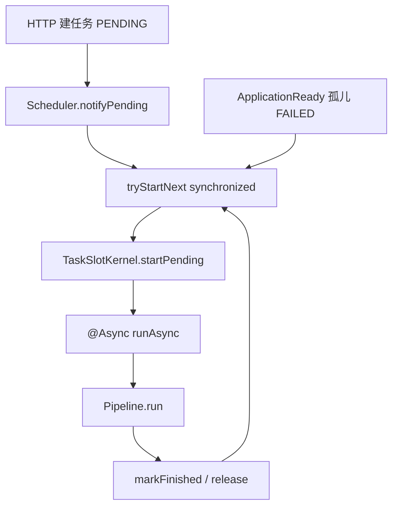

# okx-bot 后端多线程与异步调度

**对照代码，不是规划。** 记录业务自己开的线程、池、槽位和闸门。HTTP 请求默认跑在 Tomcat 线程上，本文不展开容器线程模型。

没有虚拟线程、Reactor/`Flux`、`ForkJoinPool`、`parallelStream`。多实例时槽位、上传 Semaphore、聊天流注册表都是**进程内**的。

模式层面的 Scheduler / SSE Hub 见 [后端设计模式落地说明.md](./后端设计模式落地说明.md) 第 8、9 节。本文只回答：线程从哪来、跑什么、上限多少。

---

## 怎么读

四类用法，按「会不会自己造线程」分开：

| 类别 | 会造线程？ | 典型入口 |
|------|------------|----------|
| 长任务模块池 | 是，Spring `ThreadPoolTaskExecutor` | `*AsyncConfig` + `*TaskAsyncRunner` |
| 聊天 SSE 池 | 是，手写 `ThreadPoolExecutor` | `ChatService.streamExecutor` |
| 任务内短命池 | 是，`Executors.newFixedThreadPool` | `AssetStep` 出图 / TTS |
| 守护线程 + `@Scheduled` | 是（daemon）/ 否（调度器线程同步跑） | Whisper/Remotion/Horizon；各 Job |

不造线程、只防并发打爆：`KbUploadLimiter`、`UserSseHub`、登录/验证码内存桶。

---

## 1. 总图

```
用户请求（Tomcat 线程）
  ├─ 聊天 SSE
  │     └─ chat-stream 池
  │           └─ LLM 流 + 每次调用一个 llm-stream-idle-watch
  └─ 创建长任务 → PENDING 入库 → 立刻返回 taskId
        └─ Scheduler.tryStartNext() 占槽
              └─ @Async 模块池
                    ├─ video：本线程跑 yt-dlp / ffmpeg / Whisper HTTP
                    ├─ article：抓取 + LLM
                    ├─ imggen：润色 + 出图
                    └─ aigen：规划后，镜级再开 aigen-visual-img / aigen-visual-tts
```

设计意图：按业务隔离小池、槽位限并发、拒绝策略偏保守，避免下载/出图把聊天和支付挤死。

---

## 2. 长任务：四套独立池 + 槽位

video / aigen / article / imggen 同一套路：

```
HTTP 建任务（PENDING）
        ↓
Scheduler.tryStartNext()     synchronized；内存槽 ∩ DB 进行中
        ↓
XxxTaskAsyncRunner.runAsync()   @Async(专用线程池)，独立 Bean
        ↓
Pipeline.run(taskId)         工作线程里跑完整流水线
        ↓
markFinished → 再调度下一单
```

`@Async` 必须在独立 Bean 上，同类自调用不会走代理。`@EnableAsync` 挂在 `VideoAsyncConfig` / `ArticleAsyncConfig`，全应用生效，所以 aigen / imggen 不必再标一次。

每个 Scheduler **自己 `new TaskSlotKernel("模块名")`**，不要做成全局 Bean，否则 video 会抢走 aigen 的槽。内核：`ConcurrentHashMap.newKeySet()` 记 running / pause / cancel；`startPending` 占槽后再调 runner。模块自己负责：查 PENDING、进程重启把孤儿标 FAILED、article 每用户上限。

协作式暂停/取消：HTTP 只打标记，流水线在步骤边界轮询。不会 `Thread.interrupt` 杀工作线程。video 的外部进程另走 `ProcessExecutor.destroyTaskProcesses`。

### 线程池与槽位

| 模块 | Bean / 线程名前缀 | 池规模 | 拒绝策略 | 调度上限 |
|------|-------------------|--------|----------|----------|
| video | `videoTaskExecutor` / `video-task-` | core 2 / max 4 / queue 50 | **CallerRuns**（队列满回落到调用线程） | 硬编码 `VideoTaskScheduler.MAX_CONCURRENT = 2` |
| aigen | `aigenTaskExecutor` / `aigen-task-` | core 1 / max 2 / queue 20 | Abort（避免拖垮 HTTP） | `aigen.max-concurrent-tasks` 默认 **1** |
| imggen | `imggenTaskExecutor` / `imggen-task-` | core 1 / max 2 / queue 20 | Abort | `imggen.max-concurrent-tasks` 默认 2 |
| article | `articleTaskExecutor` / `article-task-` | 配置：core 2 / max 4 / queue 50 | Abort | 全局 2 + **每用户 2** |

配置入口：`src/main/resources/config/ai.yml`（aigen / imggen / article）；video 池写死在 `VideoAsyncConfig`。article 池大小来自 `article.async.*`。

### 代码入口

| 角色 | 类型 |
|------|------|
| 槽内核 | `common.task.TaskSlotKernel` |
| 调度 | `video.agent.VideoTaskScheduler`、`aigen.agent.AigenTaskScheduler`、`article.agent.ArticleTaskScheduler`、`imggen.agent.ImgGenTaskScheduler` |
| 异步触发 | 同包 `*TaskAsyncRunner` |
| 池 | `video.config.VideoAsyncConfig`、`aigen.config.AigenAsyncConfig`、`article.config.ArticleAsyncConfig`、`imggen.config.ImgGenAsyncConfig` |

启动恢复：各 Scheduler 听 `ApplicationReadyEvent`，把 DB 里残留的进行中状态标 FAILED 再 `tryStartNext()`。否则内存槽清空、DB 仍占满 `max-concurrent`，新任务会一直「排队中」。



---

## 3. 聊天 SSE：手写有界池

`ChatService` **不走 `@Async`**，自己建池：

- core 4 / max 32 / keepAlive 60s / queue 64
- 线程名 `chat-stream`，daemon
- `AbortPolicy`：打满回「对话服务繁忙」

`sendMessageStream` / `regenerateStream` / `editResendStream`：HTTP 线程立刻返回 `SseEmitter`，调模型、写库、推 delta 在池里做。进池前拷贝 `SecurityContext`（Security 默认绑请求线程）。

配套：

| 类型 | 作用 |
|------|------|
| `ChatStreamRegistry` | `ConcurrentHashMap` 登记活跃流；同一用户同一会话只一条，新流 cancel 旧流 |
| `ChatStreamHandle` | `AtomicBoolean` 取消标志 |
| `AgentTurnScope` | `ThreadLocal` 把 cancel / phase 绑到当前流线程，避免污染单例 LangGraph 节点 |

### LLM 空闲看门狗（按次短命调度线程）

`LlmChatGateway` 每次流式调用 `Executors.newSingleThreadScheduledExecutor`（`llm-stream-idle-watch`），200ms 扫一次：用户取消或空闲超时则 `CountDownLatch.countDown()`，解开阻塞的调用线程。不是常驻池，用完关掉。

---

## 4. aigen 镜级并行：任务内短命池

一条成片已经在 `aigen-task-*` 上跑。`AssetStep` 出图 / 口播再开临时池：

- 出图：`newFixedThreadPool(min(imageConcurrency, shotCount))`，线程名 `aigen-visual-img`
- TTS：同样模式，`aigen-visual-tts`
- `CompletableFuture.runAsync(..., pool)` + `allOf().join()`
- `AtomicReference firstError` + `AtomicInteger done`：失败快停、进度 SSE
- 写进度 `synchronized (task)`，只 patch 进度列，避免并行覆盖大字段
- `finally { pool.shutdownNow() }`

当前 `aigen.visual.image-concurrency: 1`，默认等于串行。调大才会并行打 Flux。NVIDIA 瞬时故障时日志会提示降低该值。

---

## 5. 守护线程：托管进程、启动不阻塞

不是业务池，是为了不堵调用线程、也不堵子进程管道。

| 位置 | 线程名 | 作用 |
|------|--------|------|
| `video.bootstrap.WhisperProcessManager` | `whisper-log-pump` | 抽 Whisper stdout |
| `aigen.adapter.render.RemotionProcessManager` | `aigen-remotion-log` | 抽 Node 渲染 stdout；`ensureRunning` 用 `synchronized (lock)` 只起一份 |
| `horizon.service.HorizonCliRunner` | `horizon-cli-drain` | 丢掉 CLI stdout，再 `waitFor` |
| `horizon.job.HorizonRefreshJob` | `horizon-startup-refresh` | 启动 daemon 刷新，避免卡住 `ApplicationReady` |

`ProcessExecutor`（yt-dlp / FFmpeg / edge-tts）在**调用线程**上 `waitFor`。`ThreadLocal<Long> boundTaskId` + `ConcurrentHashMap<taskId, Set<Process>>` 把进程挂到任务上，暂停/取消时 `destroy`。

---

## 6. `@Scheduled`：定时，默认单线程

`@EnableScheduling` 在 `OkxBotApplication`。Spring 默认**一个**调度线程，Job 方法同步执行，长任务会互相堵住。知识库索引也走这条，没有单独 worker 池。

| Job | 频率（默认） | 做什么 |
|-----|--------------|--------|
| `rag.index.KbIndexWorker.tick` | 每 20s（`kb.rag.worker-cron`） | outbox CAS PENDING→RUNNING 后**串行** `process` |
| `pay.job.PayOrderJobs` | 每分钟 ×3 | 关单 / 查单补单 / 履约补偿（假定单实例） |
| `member.job.MemberExpireJob` | 每小时 :05 | 过期会员降级兜底 |
| `kb.service.KbUploadCleanupJob` | 每 15 分钟 | 过期分片上传清理 |
| `horizon.job.HorizonRefreshJob` | 每小时 :05 + 每 10 分钟 | 刷新 / 导入摘要 |
| `common.sse.UserSseHub.heartbeat` | 每 20s | 给所有任务 SSE 发 ping |

---

## 7. 并发闸门（不造线程）

多线程环境下的共享状态，本身不 `start()` 线程。

| 类型 | 原语 | 作用 |
|------|------|------|
| `KbUploadLimiter` | 全局/每用户 `Semaphore` + 会话 `AtomicInteger` CAS | 分片上传闸门；注释写明只保单进程 |
| `UserSseHub` | `ConcurrentHashMap` + `CopyOnWriteArrayList` | channel + userId 扇出；每用户最多 3 条连接 |
| `ConfirmTokenService` | `ConcurrentHashMap` | Agent 确认卡 token |
| `LoginRateLimiter` / `EmailCodeService` | `ConcurrentHashMap` + 局部 `synchronized` | 登录失败桶、发信限流 |
| `OAuthTokenStore` | `ConcurrentHashMap` | 用过的 jti |
| `AlipayClientFactory` / `QdrantVectorStoreAdapter` | `volatile` + `synchronized` | 客户端 / collection 懒初始化 |

知识库分片上限见 `config/platform.yml`：`max-concurrent-parts-per-user: 6`、`global: 16`、`complete-global: 2`。

---

## 8. 刻意没有的东西

- 虚拟线程 / `spring.threads.virtual`
- WebFlux
- 全局共用一个任务线程池
- RAG 索引线程池（定时器线程里串行）
- 跨实例分布式锁（支付 Job、槽位、上传闸门都假定单实例）

调并发时优先改配置，而不是加池：`aigen.max-concurrent-tasks`、`imggen.max-concurrent-tasks`、`article.max-concurrent-tasks`、`aigen.visual.image-concurrency`。video 全局槽位目前写死为 2，改池大小时要和 `VideoTaskScheduler.MAX_CONCURRENT` 一起看。
