# okx-bot 后端设计模式落地说明

记录**已经写进代码**的模式：每种做什么、用在哪、为什么选它而不是把逻辑堆在 Service 里。  
后续横切抽取（SSE Hub、任务调度内核等）也补在本文，避免和模块设计手册各说各话。

---

## 怎么读

- **作用**：这个模式在软件里解决什么问题。
- **为何用在这里**：结合本仓库的真实约束（多供应商、可 mock、可回滚、前端要实时状态）。
- **类结构**：下面每节的 mermaid 是**仓库里真实类型**（接口 / 实现 / 调用方），不是教科书示意。
- **代码入口**：从这些类型往下看即可。

不在本文展开、也不该硬套模式的模块：`kb`（CRUD + 事务）、`horizon`（ingest/job）、`member`（套餐/过期）、`auth` 主体（Spring Security + JWT + JustAuth）。邮箱 / OAuth / 微信小程序入口和 DTO 不同，拆 `LoginStrategy` 没有收益。

---

## 1. Ports & Adapters（六边形）

**作用**：业务只依赖「端口」接口；真正调 Edge-TTS、Remotion、FLUX、R2、Halo 的代码放在 Adapter。换实现或本地 mock 时，Pipeline / Service 不用改。

**为何用在这里**：AI 工具台的出站依赖又多又脆（本机 CLI、HTTP 微服务、云厂商协议互不兼容）。设计文档明确禁止用 LangChain4j 接管 TTS / Remotion / FLUX。端口把「生成分镜」和「调哪个模型」切开，才能按步骤 mock、按 `ai.chat-engine` 回滚。

| 能力 | 端口 | 适配器（实现） |
|------|------|----------------|
| 成片规划 / 导演 | `ScriptPlanPort` / `DirectorPort` | LangChain4j / OkHttp / Mock |
| 配音 | `TtsPort` | Edge / Windows SAPI / Mock / Auto 回退 |
| 图生视频 | `ImageToVideoPort` | Kinetic / NVIDIA SVD / Composite |
| 渲染 | `VideoRenderPort` | Remotion HTTP / Mock |
| 文章抓取 / 抽取 / LLM | `ArticleFetchPort` 等 | Toutiao、GenericHtml、Langchain CORE/REWRITE |
| 文生图 / 润色 | `ImageGenPort` / `PromptEnhancePort` | NVIDIA FLUX、LLM 润色、Mock |
| 对象存储 | `ObjectStoragePort` | `LocalObjectStorage` / `R2S3ObjectStorage` |
| 博客发布 | `HaloPublishPort` | HTTP / Disabled |

装配入口：`AigenBeanConfig`、`ArticleBeanConfig`、`ImgGenBeanConfig`、`StorageConfiguration`。业务侧只注入 Port。

**视频理解**：`VideoUnderstandingPort.protocolId()` 由 Mock / Omni / 抽帧实现；`VideoUnderstandingRouter` 按 `protocol`（mock / auto / nvidia-omni-chat / frame-vlm）选择，Omni 媒体失败且 `fallback-frame-vlm` 时回退抽帧。`VideoUnderstandingService` 只做分片、暂停、ASR 切片与聚合。

### 类结构：成片（aigen）出站端口

`AigenBeanConfig` 按 `mock-pipeline` / `steps.*` / `ai.chat-engine` 把右侧 Adapter 接到左侧 Port。Pipeline / Step 只认 Port。

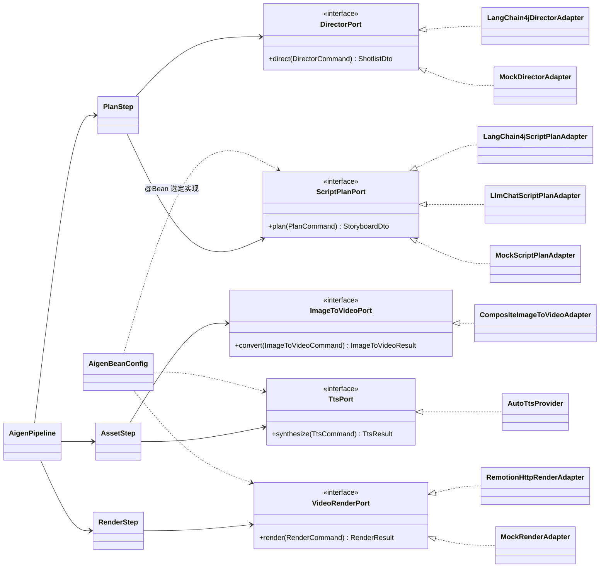

### 类结构：存储 / 博客 / 文生图 / 文章 LLM

```mermaid
classDiagram
    direction TB
    class ObjectStoragePort {
        <<interface>>
        +put(key, file, contentType)
        +exists(key) boolean
        +providerId() String
    }
    class LocalObjectStorage
    class R2S3ObjectStorage
    class StorageConfiguration
    ObjectStoragePort <|.. LocalObjectStorage
    ObjectStoragePort <|.. R2S3ObjectStorage
    StorageConfiguration ..> ObjectStoragePort : storage.provider=local|r2

    class HaloPublishPort {
        <<interface>>
        +publish(HaloPublishCommand) HaloPublishResult
    }
    class HaloHttpPublishAdapter
    class DisabledHaloPublishAdapter
    class HaloClientResolver
    HaloPublishPort <|.. HaloHttpPublishAdapter
    HaloPublishPort <|.. DisabledHaloPublishAdapter
    HaloClientResolver --> HaloPublishPort : 超管平台 / 用户自绑

    class ImageGenPort {
        <<interface>>
        +generate(ImageGenCommand) ImageGenResult
    }
    class PromptEnhancePort {
        <<interface>>
        +enhance(prompt) String
    }
    class NvidiaFluxImageAdapter
    class MockImageGenAdapter
    class LlmPromptEnhanceAdapter
    class ImgGenBeanConfig
    ImageGenPort <|.. NvidiaFluxImageAdapter
    ImageGenPort <|.. MockImageGenAdapter
    PromptEnhancePort <|.. LlmPromptEnhanceAdapter
    ImgGenBeanConfig ..> ImageGenPort

    class ArticleFetchPort {
        <<interface>>
        +supports(platform) boolean
        +fetch(ArticleFetchCommand) ArticleFetchResult
    }
    class ArticleCoreLlmPort {
        <<interface>>
        +extractCore(doc, cmd) ArticleCoreResult
    }
    class ArticleRewriteLlmPort {
        <<interface>>
        +rewrite(core, doc, cmd) ArticleRewriteResult
    }
    class LangchainArticleCoreAdapter
    class LangchainArticleRewriteAdapter
    ArticleCoreLlmPort <|.. LangchainArticleCoreAdapter
    ArticleRewriteLlmPort <|.. LangchainArticleRewriteAdapter
```

### 类结构：视频理解端口 + Router

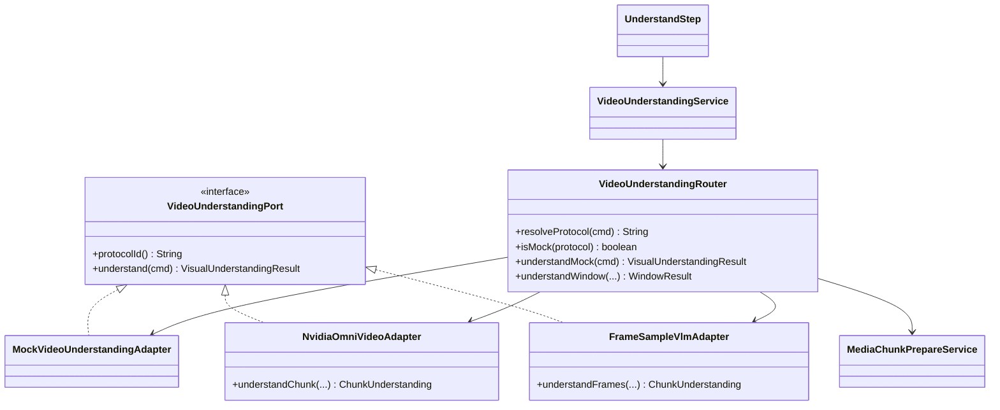

---

## 2. Strategy + Registry（策略 + 注册表）

**作用**：同一件事多种算法，运行时按 id 选一个；新算法 = 新类，调用方不改 switch。

**为何用在这里**：

**支付**要同时存在 Mock（本机开通会员）、支付宝（进件后扫码/H5）、微信（枚举已留、实现未写）。下单、回调验签、查单协议完全不同，不能写在 `PayOrderService` 里。`PaymentChannelRegistry.require(channelId)` 按开关拒绝未启用通道。加微信只需 `WechatPaymentChannel implements PaymentChannel`。

**Chat Agent 工具**：模型只能调白名单。`AgentTool` + `ToolRegistry` 把 `search_notes`、`draft_aigen` 等收成策略；`ToolExecutionService` 做未知工具拒绝和 WRITE 风险门禁。WRITE 只产确认草案，真正创建走 `AgentConfirmService`。编排用 LangGraph4j `StateGraph`（retrieve → decide → execute），**不能**换成 LangChain / LangGraph4j AgentExecutor 自动调写工具。

### 类结构：支付通道

```mermaid
classDiagram
    class PaymentChannel {
        <<interface>>
        +channelId() String
        +createPayment(order, ctx) PaymentCreateResult
        +parseAndVerifyNotify(headers, body) NotifyParseResult
        +queryPayment(order) ChannelTradeQueryResult
    }
    class MockPaymentChannel
    class AlipayPaymentChannel
    class PaymentChannelRegistry {
        -Map~String,PaymentChannel~ channels
        +require(channelId) PaymentChannel
    }
    class PayOrderService
    class PayNotifyService
    class PayChannel {
        <<enumeration>>
        MOCK
        ALIPAY
        WECHAT
    }

    PaymentChannel <|.. MockPaymentChannel
    PaymentChannel <|.. AlipayPaymentChannel
    PaymentChannelRegistry --> PaymentChannel : List 注入后按 channelId 索引
    PayOrderService --> PaymentChannelRegistry
    PayNotifyService --> PaymentChannelRegistry
    PaymentChannelRegistry ..> PayChannel : normalize / 开关校验
    note for PaymentChannelRegistry : WECHAT 已在枚举与 require() 中\n尚无 WechatPaymentChannel
```

### 类结构：Agent 工具白名单

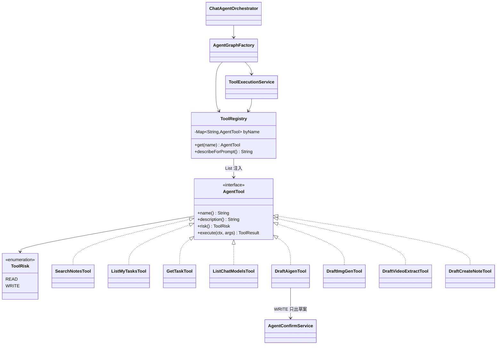

---

## 3. Composite / 回退链

**作用**：对外一个接口，对内按优先级试多个实现，失败再下一个。

**为何用在这里**：外部能力经常「有更好的、但不保证活着」。

| 组合点 | 顺序 | 原因 |
|--------|------|------|
| `CompositeArticleFetchAdapter` | 专用平台（头条）→ Generic HTML | 头条要解析 `RENDER_DATA`；其它站走通用抽取。Pipeline 禁止 `PASTE_ONLY` 打 HTTP。显式注入实现，避免 `List<ArticleFetchPort>` 把 Composite 自己注入进去。 |
| `CompositeImageToVideoAdapter` | `nvidia-svd` 可失败回退 kinetic；`auto` 同理 | SVD 是云端图生视频，kinetic 是本地镜运动效，保证镜头仍有画面。 |
| `AutoTtsProvider` | Edge-TTS → Windows SAPI → 可选 mock | 微软接口会 `NoAudioReceived`；本机 Windows 还能出声，避免整任务失败。 |

这是责任链的窄用法：链短、顺序由配置决定，不必上框架。

### 类结构

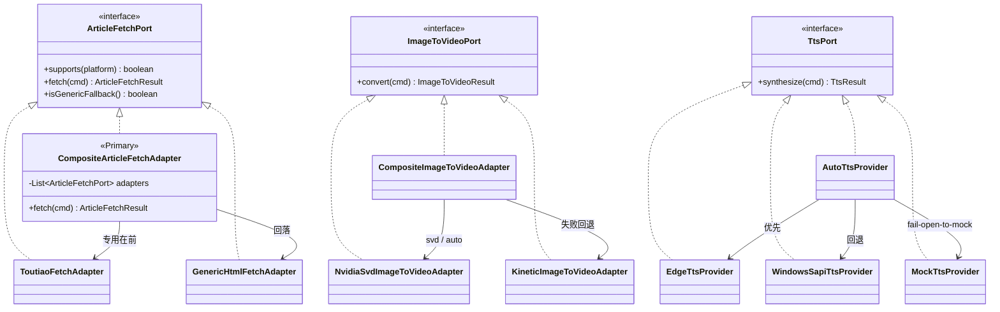

---

## 4. Factory（工厂）

**作用**：把「怎么构造复杂对象」从使用处拿走，集中处理配置、校验、默认值。

**为何用在这里**：

- **`ChatModelFactory`**：每个任务可以指定不同 provider/model/超时。不能注册全局单例 `ChatModel`。密钥和 base-url 来自 `ai.providers`；OpenAI 兼容 URL 要归一化到 `/v1`。测试连通性要用短超时，和正式生成 180s 不是同一个对象。
- **`AlipayClientFactory`**：证书/密钥 PEM 归一化、沙箱与正式客户端。
- **`HaloClientResolver`**（工厂方法）：超管用平台 yml；普通用户必须自绑 token。两种 `HaloPublishPort` 实例生命周期不同，不适合一个全局 Bean。
- **各 `*BeanConfig`**：按 `mock-pipeline` / `steps.*` / `ai.chat-engine` 在启动时选定 Port 实现。这是装配期工厂，不是运行时 `if (mock)` 散落在 Pipeline。

### 类结构

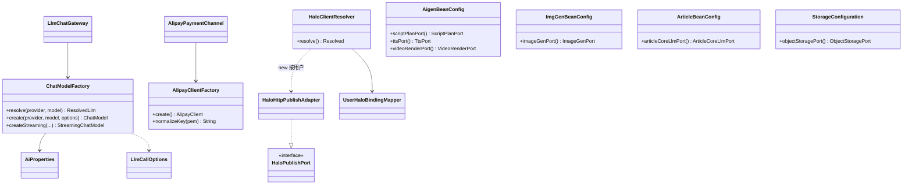

---

## 5. Facade（门面）

**作用**：对内几套实现，对外一个聊天 API（重试、超时、流式、空闲看门狗）。

**为何用在这里**：video / aigen / imggen / chat / article 都要调 OpenAI 兼容 Chat。历史上手写 OkHttp，后来切 LangChain4j，必须 **一键回滚**。

见 `doc/LangChain4j_三工具切换架构设计.md`：只换 Chat 出口，不换调度、TTS、Remotion、FLUX。温度/重试仍读 `video.llm.*`（历史前缀）。

### 类结构

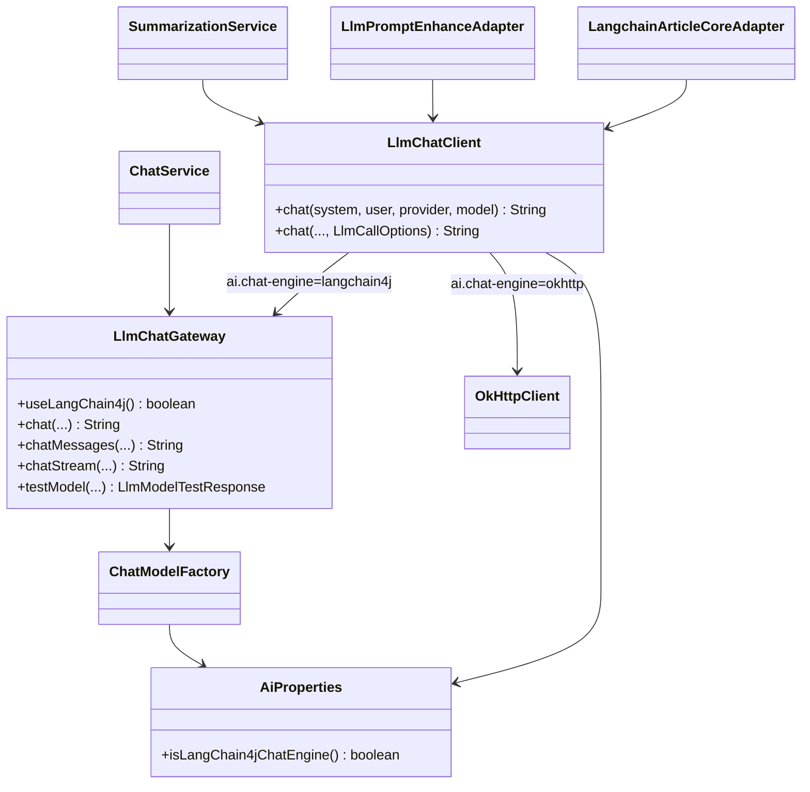

---

## 6. Null Object / Mock Adapter

**作用**：用「什么都不干或返回假数据」的实现满足接口，调用方不必 `if (disabled)`。

**为何用在这里**：本机、CI、没装 edge-tts / Remotion / 没配 Halo 时，流水线仍要能跑通状态机和前端。

- `DisabledHaloPublishAdapter`：未配置博客时的明确失败文案。
- `MockTtsProvider` / `MockRenderAdapter` / `MockImageGenAdapter` / `MockScriptPlanAdapter` / `MockVideoUnderstandingAdapter`：`mock-pipeline=true` 或单步 `steps.*=mock`。
- `AutoTtsProvider` 在 `fail-open-to-mock` 时落到 Mock：配音失败仍能出片（无声或占位），而不是整单 FAILED。

Mock 是产品能力（演示、联调），不是测试替身。

### 类结构

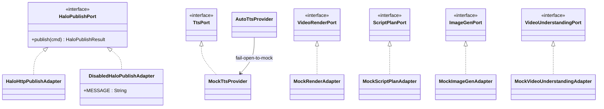

---

## 7. Command（命令对象）

**作用**：把一次出站调用的参数收成不可变（或 builder）对象，避免 Port 方法参数列表无限变长。

**为何用在这里**：同一端口会被 Pipeline、重试、测试模型连通性调用；参数含语言、模型、URL、是否抽思维导图等。Adapter 只认 Command，不认 `AigenTaskEntity`，避免基础设施依赖任务表。

### 类结构

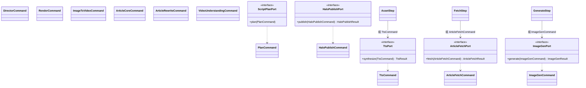

---

## 8. Template Method（步骤接口 + 任务槽内核）

**作用**：固定「按步骤执行、步骤间可停」的骨架，每步自己负责状态文案和进度。

**为何用在这里**：成片是 Plan → Asset → Render，文生图是 Enhance → Generate。暂停/取消只在步骤边界生效（长耗时 CLI 无法立刻杀）。`PipelineStep`（`name` / `runningStatus` / `stepLabel` / `progressPercent` / `execute`）让 `AigenPipeline` / `ImgGenPipeline` 用同一套循环：更新状态 → 执行 → 记耗时 → SSE。

video 已拆 `DownloadStep` / `TranscribeStep` / `UnderstandStep` / `SummarizeStep`，由 `UnderstandingMode.stepsAfterDownload()` 选步；超长 hybrid 由 `OmniDurationGuard` 降为 audio_only。

article 已拆 `ResolveStep` → `FetchStep` → `ExtractStep` → `CoreStep` → `RewriteStep`；`ArticleFetchPolicy` 决定跳过抓取 / NEEDS_PASTE / 用粘贴 / 失败。mock-pipeline 仍走外壳里的假数据路径（不模拟 NEEDS_PASTE）。

**任务槽（`TaskSlotKernel`）**：四套 Scheduler 曾各自复制 `activeTaskIds` + pause/cancel 集合 + `occupied = max(DB进行中, 内存槽)`。内核只做占槽、协作标记、FIFO `startPending`。每个 Scheduler **自己 new 一份**（不是全局 Bean），否则 video 会抢走 aigen 的槽。模块仍负责：PENDING 查询、孤儿标 FAILED、article 每用户上限。

线程从哪来、池多大、拒绝策略、聊天 SSE / 镜级并行 / `@Scheduled`：见 [后端多线程与异步调度.md](./后端多线程与异步调度.md)。

### 类结构：四套步骤流水线

各模块的 `PipelineStep` 接口同名但**分属不同包**（aigen / imggen 各一份；video / article 带模块前缀），不要抽成 common 泛型框架。

```mermaid
classDiagram
    class AigenPipeline {
        +run(taskId)
    }
    class AigenPipelineStep {
        <<interface>>
        +name() String
        +runningStatus() AigenTaskStatus
        +execute(PipelineContext)
    }
    note for AigenPipelineStep : 实际类型名 PipelineStep\n包 aigen.agent.step
    class PlanStep
    class AssetStep
    class RenderStep
    AigenPipeline --> PlanStep
    AigenPipeline --> AssetStep
    AigenPipeline --> RenderStep
    AigenPipelineStep <|.. PlanStep
    AigenPipelineStep <|.. AssetStep
    AigenPipelineStep <|.. RenderStep

    class ImgGenPipeline
    class ImgGenPipelineStep {
        <<interface>>
    }
    note for ImgGenPipelineStep : 实际类型名 PipelineStep\n包 imggen.agent.step
    class EnhanceStep
    class GenerateStep
    ImgGenPipeline --> EnhanceStep
    ImgGenPipeline --> GenerateStep
    ImgGenPipelineStep <|.. EnhanceStep
    ImgGenPipelineStep <|.. GenerateStep

    class VideoProcessingPipeline
    class VideoPipelineStep {
        <<interface>>
        +applies(UnderstandingMode) boolean
        +execute(VideoPipelineContext)
    }
    class DownloadStep
    class TranscribeStep
    class UnderstandStep
    class SummarizeStep
    class UnderstandingMode {
        <<enumeration>>
        +stepsAfterDownload() List
    }
    class OmniDurationGuard {
        <<utility>>
        +enforce(...) UnderstandingMode
    }
    VideoProcessingPipeline --> DownloadStep
    VideoProcessingPipeline --> TranscribeStep
    VideoProcessingPipeline --> UnderstandStep
    VideoProcessingPipeline --> SummarizeStep
    VideoProcessingPipeline ..> UnderstandingMode
    VideoProcessingPipeline ..> OmniDurationGuard
    VideoPipelineStep <|.. DownloadStep
    VideoPipelineStep <|.. TranscribeStep
    VideoPipelineStep <|.. UnderstandStep
    VideoPipelineStep <|.. SummarizeStep

    class ArticlePipeline
    class ArticlePipelineStep {
        <<interface>>
        +applies(ctx) boolean
        +execute(ArticlePipelineContext)
    }
    class ArticleFetchPolicy {
        <<utility>>
        +skipFetch(Snapshot) boolean
        +onSourceFailure(Snapshot) OnFailure
    }
    class ResolveStep
    class FetchStep
    class ExtractStep
    class CoreStep
    class RewriteStep
    ArticlePipeline --> ResolveStep
    ArticlePipeline --> FetchStep
    ArticlePipeline --> ExtractStep
    ArticlePipeline --> CoreStep
    ArticlePipeline --> RewriteStep
    ArticlePipelineStep <|.. ResolveStep
    ArticlePipelineStep <|.. FetchStep
    ArticlePipelineStep <|.. ExtractStep
    ArticlePipelineStep <|.. CoreStep
    ArticlePipelineStep <|.. RewriteStep
    ResolveStep ..> ArticleFetchPolicy
    ExtractStep ..> ArticleFetchPolicy
```

### 类结构：任务槽内核

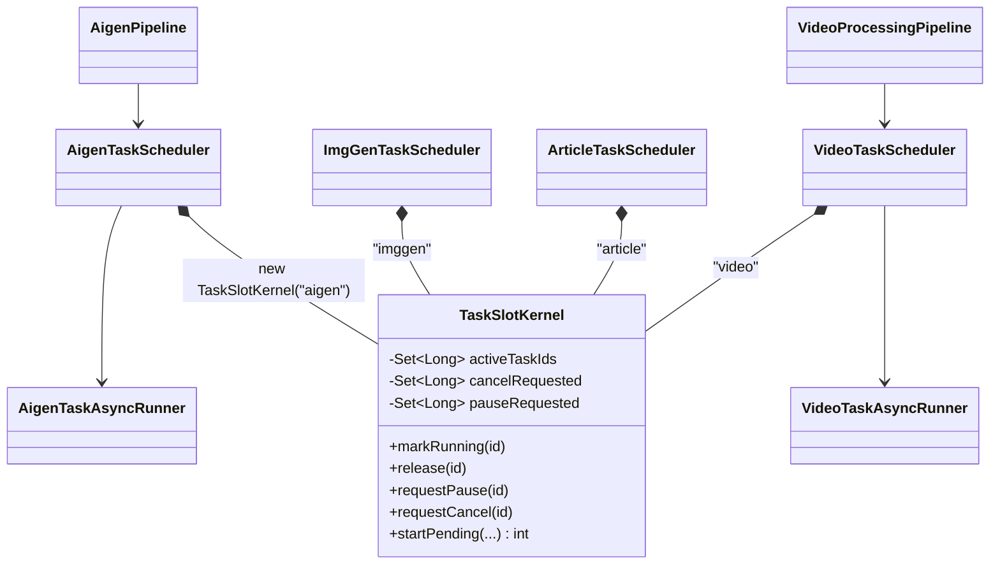

---

## 9. Observer（观察者）— 任务 SSE，含 UserSseHub

**作用**：任务状态变化时，主动通知已订阅的前端，而不是前端 3 秒轮询列表。

**为何用在这里**：下载/转录/出图可能跑几分钟，步骤切换要接近实时；无活跃任务时应零轮询。浏览器订阅的是 `text/event-stream`（`SseEmitter`），不是 Spring `ApplicationEvent`（后者到不了浏览器）。

历史实现：`VideoTaskEventPublisher` 被 aigen / article / imggen **整文件复制**，只有 `toLightData` 不同。连接数上限、踢最旧连接、TEXT_PLAIN 发已序列化 JSON（避免 `APPLICATION_JSON` 把 String 再包一层引号）、20s ping，四处各写一遍。

**抽内核后**：

- **channel 隔离**：用户分别订阅四条 URL。若共用一张 `userId → emitter` 表，视频事件会打进成片页。Hub 用 `channel`（`video` / `aigen` / `article` / `imggen`）分桶。
- **单机内存**：与 `doc/VideoCoreExtractor_任务状态推送方案.md` 一致；多实例再在 Hub 后加 Redis，Publisher 的 `publishEntity` 不必改。
- **envelope**：video 历史只有 `taskId`；其余模块额外写 `id` 别名。Hub 用 `aliasId` 保持线格式，避免前端解析回归。

模块 Publisher 只保留：事件类型常量、实体 → 轻量 Map、是否 `aliasId`。连接、心跳、死连接清理只在 `UserSseHub`。

### 类结构

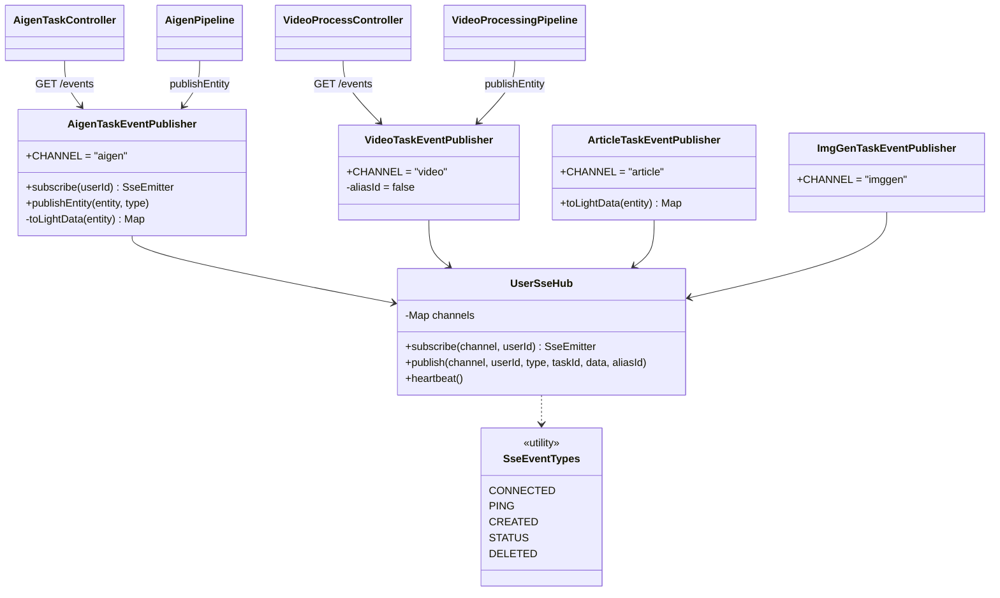

调用链：

```
Pipeline / TaskService 写库
        → XxxTaskEventPublisher.toLightData（模块轻量字段）
        → UserSseHub.publish(channel, userId, …)
                按 channel+userId fan-out
        → 浏览器 GET /api/v1/{video|aigen|article|imggen}/events
```

---

## 10. 模式与模块对照

| 模块 | 已落地 | 有意不套 |
|------|--------|----------|
| aigen | Port/Adapter、Step、TTS/I2V 回退、SSE、TaskSlotKernel | 不要 AbstractPipeline 吞掉 storyboard |
| imggen | Port/Adapter、Step、SSE | 第二家生图再用 Registry；禁止 ImageModel 硬套 FLUX |
| article | Fetch 组合、LLM Port、SSE、Step + FetchPolicy | 不要为每个 Status 写 State 类 |
| video | 理解模式选步、Step、SSE、Understanding Router | — |
| chat | Tool 策略、Orchestrator、LLM Facade | 不要框架自动 Agent |
| pay | Channel 策略 | 补微信实现即可 |
| storage | Port local/r2 | — |
| blog | Port + Resolver 工厂 + Disabled | — |
| common.ai | Factory + Facade + 可回滚引擎 | 重试暂不引入 Resilience4j |
| kb / auth / member / horizon | 常规分层 | 不为此引入 GoF |

---

## 11. 和「下一步抽取」的边界

本文只描述**代码里已经有的**。已落地：SSE Hub、任务槽内核、video Step + 模式选步、Understanding Router、article Step + FetchPolicy。后续按产品需求再做微信支付通道 / 第二生图 Registry。

线程池与调度清单不在本文展开，见 [后端多线程与异步调度.md](./后端多线程与异步调度.md)。
