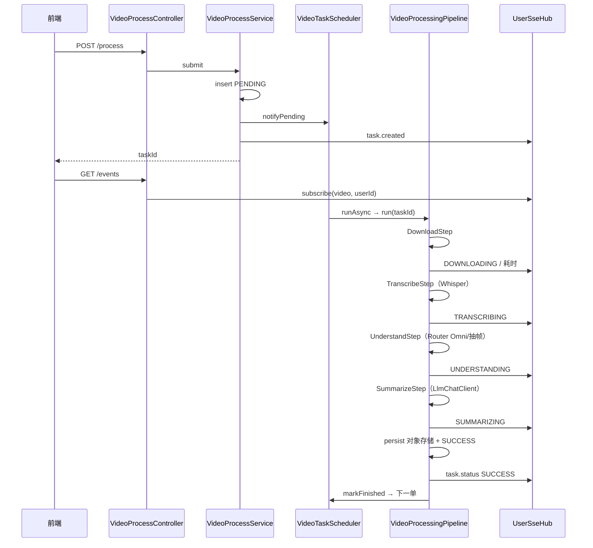

# 视频提取：任务流程与设计模式

**模块**：`com.dwcode.okxbot.video`  
**入口**：`POST /api/v1/video/process`  
**本文**：按**当前代码**把一次提取从接单到成功/失败走完，再对照这条链上实际用了哪些设计模式。  
**类清单 + 接口路径（更适合从头读模块）：** [视频提取_模块导读.md](./视频提取_模块导读.md)。

旧文档 `VideoCoreExtractor_核心接口调用路径.md` 仍按「下载→转写→总结」三步写，已过时。以本文为准。

---

## 1. 这条链路在干什么

用户贴一个视频链接，后端异步完成（按模式可少跑几步）：

```text
下载（yt-dlp + ffmpeg）
  → 转写（Whisper HTTP）
  → 画面理解（可选：Omni 或抽帧）
  → LLM 总结（纯字幕 或 字幕+画面 Fuse）
  → 产物上传对象存储，scratch 清掉
```

HTTP **只接单、查单、暂停、重试**。重活在独立线程池里跑，全局最多约 2 个同时执行（`VideoTaskScheduler.MAX_CONCURRENT` 与 `videoTaskExecutor` 核心线程对齐）。

---

## 2. 分层（从外到内）

```text
VideoProcessController          REST / SSE
        │
VideoProcessService             建任务、权限、暂停/重试规则
        │
VideoTaskScheduler              槽位 + PENDING FIFO + 暂停标记
        │                       （内部 TaskSlotKernel("video")）
VideoTaskAsyncRunner            @Async(videoTaskExecutor)
        │
VideoProcessingPipeline         骨架：暂停边界、落库、SSE
        │
  DownloadStep / TranscribeStep / UnderstandStep / SummarizeStep
        │
  VideoDownloadService / TranscriptionService / VideoUnderstandingService / SummarizationService
        │
  WhisperClient / VideoUnderstandingRouter / LlmChatClient
        │
  yt-dlp · ffmpeg · whisper-service · Omni/VLM API · LLM API
        │
  StorageService → ObjectStoragePort（local / R2）
  VideoTaskEventPublisher → UserSseHub（channel=video）
```

| 层 | 类 | 职责 |
|----|-----|------|
| 入口 | `VideoProcessController` | 映射、包装 `ApiResult`，不写业务 |
| 应用 | `VideoProcessService` | 会员校验、每用户并发、规范化 URL、选模型、CRUD 任务 |
| 调度 | `VideoTaskScheduler` | 最多 2 槽、FIFO、重启把进行中标 FAILED |
| 异步 | `VideoTaskAsyncRunner` | 独立 Bean，保证 `@Async` 生效 |
| 编排 | `VideoProcessingPipeline` | 步骤循环、暂停、成功 persist、失败清理 |
| 步骤 | `video.agent.step.*` | 单步：下载 / 转写 / 理解 / 总结 |
| 领域 | `VideoDownloadService` 等 | 单步业务，可单测 |
| 出站 | `WhisperClient`、Router、Adapter、`LlmChatClient` | HTTP / CLI |
| 存储 | `StorageService` + `ObjectStoragePort` | scratch → 对象存储 |
| 推送 | `VideoTaskEventPublisher` + `UserSseHub` | 按用户 SSE |

---

## 3. 状态机

```text
PENDING ──执行──► DOWNLOADING ──► TRANSCRIBING ──► UNDERSTANDING ──► SUMMARIZING ──► SUCCESS
                      │                │                 │                 │
                      └────────────────┴─────────────────┴─────────────────┴──► FAILED
                      └────────────────┴─────────────────┴─────────────────┴──► PAUSED
PENDING 也可直接 PAUSED（排队未开跑）
PAUSED / FAILED / SUCCESS ──重试──► PENDING（清空产物再入队）
```

进程重启：DB 里还停在 DOWNLOADING / TRANSCRIBING / UNDERSTANDING / SUMMARIZING 的，启动时标 FAILED（「服务重启，请重试」），避免占死槽位。

前端进度：`GET /api/v1/video/events`（SSE）为主，列表接口可兜底。

---

## 4. 主路径：提交到成功

### 4.1 接单 `POST /api/v1/video/process`

`VideoProcessService.submit`：

1. 要有效会员；当前用户进行中+排队数不得超过 `video.max-concurrent-tasks-per-user`（默认 2），否则 429。  
2. `UnderstandingMode.from(...)`：请求里的模式，否则 yml 默认（代码默认 `audio_only`）。  
3. 需要 LLM 时校验供应商 api-key，模型从库表 `ai_model_config` 取。  
4. hybrid / omni_only 且非 mock：必须带 `video_omni` 模型，禁止 yml 写死模型 ID。  
5. URL 经 `VideoUrlNormalizer`（抖音 `modal_id` 等改成 yt-dlp 能吃的地址）。  
6. 插入 `video_task`，状态 `PENDING`，「排队中」。  
7. `taskScheduler.notifyPending()` + SSE `task.created`。  
8. **立即返回 taskId**，不在请求线程里下载。

### 4.2 调度

`VideoTaskScheduler.tryStartNext`：

- 占用 = max(DB 里进行中条数, 内存 active 槽)。  
- 空闲则按 `created_at` 拉 PENDING，`TaskSlotKernel.startPending` 占槽后 `asyncRunner.runAsync(id)`。

`VideoTaskAsyncRunner` 在 `video-task-*` 线程里调用 `pipeline.run(taskId)`。

### 4.3 流水线骨架

`VideoProcessingPipeline.run`：

1. 任务不存在 / 已是 PAUSED、SUCCESS → 释放槽位返回。  
2. `markRunning`，清暂停标记，记下 `startedAt`。  
3. 组 `VideoPipelineContext`（task、mode、pauseCheck）。  
4. **永远先跑 `DownloadStep`**。  
5. 仅下载 → 写最小 `resultJson`，`persistAndCleanupAfterSuccess`，SUCCESS「下载完成」。  
6. 否则 `OmniDurationGuard`：hybrid/omni 且时长超过软顶，配置 `force_audio` 则改成 `audio_only` 并写回任务；否则抛错失败。  
7. 对 `TranscribeStep` / `UnderstandStep` / `SummarizeStep`：`applies(mode)` 为 false 则跳过；否则更新状态 → `execute` → 落库 + SSE。步骤前后都看暂停。  
8. 全过：上传对象存储、清 scratch、SUCCESS。理解降级过则文案「完成（已降级为纯音频总结）」。  
9. 异常：若是暂停则 PAUSED 并清 scratch；否则 FAILED。`finally` 里 `markFinished` 释放槽并拉下一单。

### 4.4 模式决定跑哪些步

`UnderstandingMode.stepsAfterDownload()`：

| 模式 | 下载之后 |
|------|----------|
| `download_only` | （没有，直接成功） |
| `audio_only` | transcribe → summarize |
| `hybrid` | transcribe → understand → summarize |
| `omni_only` | understand → summarize |

步骤类用 `needsWhisper()` / `needsOmni()` / `needsLlm()` 实现 `applies`，和上表一致。

### 4.5 各步做什么

**DownloadStep**  
`VideoDownloadService.download(url, taskId, 是否抽音频)`。仅下载不抽音频。yt-dlp 拉视频，需要转写时 ffmpeg 抽音频。Cookie 走 `VideoCookieService`（抖音等）。标题、时长、本地 video/audio 路径写回任务。

**TranscribeStep**  
`TranscriptionService` → `WhisperClient` → 本机 `whisper-service`（默认 `:8000`，Java 可托管进程）。JSON 落 scratch，路径进任务。

**UnderstandStep**  
组 `VideoUnderstandingCommand`（视频路径、是否剥音轨、是否用片内音、ASR 切片）。`VideoUnderstandingService`：切时间窗 → 每窗问 Router。

Router：

- mock 或 yml `understanding.mock` → 整段假画面。  
- `frame-vlm` → 抽帧 + VLM。  
- `auto` / `nvidia-omni-chat` → 先 Omni 切片；媒体失败且 `fallback-frame-vlm` → 抽帧。  

全部窗失败且有 ASR、允许 `fallback-to-audio` → `UnderstandingDegradedException`，任务 `degraded=1`，后面总结只靠字幕。

**SummarizeStep**  
先刷新任务上的 llmProvider/llmModel（用户可能中途改）。有字幕则 Map-Reduce 成 `TranscriptDigest`（禁止把全量字幕塞进 Fuse）。有可用画面则 `summarizeFused`，否则纯 digest，再不行只用画面。结果写入 `summaryJson` / `resultJson`。LLM 走 `LlmChatClient`（门面）。

### 4.6 存储

进行中文件在 **scratch**（`StorageService` / `ScratchWorkspace`）。成功：`persistAndCleanupAfterSuccess` 把视频等推到 `ObjectStoragePort`（local 或 R2），任务里的路径改成 object key，再删 scratch。失败/暂停：`cleanupAfterFailure` 清本地中间文件。播放优先 `GET .../media-url` 预签名，Range 代理是回退。另存为走同一套 media-url（`disposition=attachment`）+ 浏览器原生下载，禁止 `arrayBuffer` 整包；见 [媒体下载_流式另存为方案.md](./媒体下载_流式另存为方案.md)。

---

## 5. 暂停、重试、SSE

**暂停** `POST .../pause`

- PENDING：直接 PAUSED，释放槽。  
- 进行中：`requestPause` + `ProcessExecutor.destroyTaskProcesses`（尽量杀掉 yt-dlp/ffmpeg）。流水线在步骤边界或下载中断后标 PAUSED。视频模块**没有**取消集合（成片/文章才有 cancel）。

**重试** `POST .../retry`  
FAILED / PAUSED / SUCCESS 可重试。可改模式和模型。删对象存储里该任务前缀，字段清空，回到 PENDING 再 `notifyPending`。SUCCESS 重试等于整条重跑。

**SSE** `GET /api/v1/video/events`  
`VideoTaskEventPublisher.subscribe` → `UserSseHub.subscribe("video", userId)`。流水线每次改状态 `publishEntity`。envelope **只有 `taskId`**（没有 aigen 那种 `id` 别名）。每用户最多 3 条连接，20s ping。频道与成片/文章/文生图隔离。

---

## 6. 一张总图（hybrid 成功）



---

## 7. 这条链上用了哪些设计模式

只讲 **video 提取这条任务** 实际碰到的。先模式是什么，再落到上图哪一跳。

### 7.1 模板方法（Template Method）——流水线骨架

**模式：** 固定「改状态 → 执行一步 → 落库/推送」，每步自己实现。暂停只在步骤交界生效（杀不掉正在跑的 ffmpeg 时，至少不要开下一步）。

**项目里：** `VideoProcessingPipeline` 的 `run` / `runStep` 是骨架；`DownloadStep` 等实现 `VideoPipelineStep`（`name` / `runningStatus` / `stepLabel` / `applies` / `execute`）。没有抽象基类 `AbstractPipeline`，模板就是这个 for 循环。

对应第 4.3 节。

### 7.2 策略（Strategy）——理解模式选步

**模式：** 同一套骨架，用一种「策略」决定跑哪些算法。

**项目里：** `UnderstandingMode` 就是策略：`needsWhisper` / `needsOmni` / `stepsAfterDownload`。`TranscribeStep.applies` 看要不要 Whisper，理解步看要不要 Omni。用户选 audio_only 还是 hybrid，不是 if-else 四套流水线。

时长超限 `OmniDurationGuard` 可能把 hybrid **换成** audio_only 策略，后面理解步自动跳过。

对应第 4.4 节。

### 7.3 适配器 + 端口（Adapter / Port）——画面理解出站

**模式：** 业务只说「理解这一窗画面」，不认 NVIDIA 视频 base64 还是多图 VLM。

**项目里：** `VideoUnderstandingPort`（`protocolId`）。实现：

- `MockVideoUnderstandingAdapter`：整段假数据  
- `NvidiaOmniVideoAdapter`：切片视频  
- `FrameSampleVlmAdapter`：抽帧  

`UnderstandStep` → `VideoUnderstandingService`（切窗、聚合）→ `VideoUnderstandingRouter`（选适配器）。下载/Whisper 没有再抽 Port，就是领域服务 + Client，因为暂时没有第二套下载器。

对应第 4.5 节 UnderstandStep。

### 7.4 组合 / 短责任链（Composite）——Omni 失败改抽帧

**模式：** 对外一次 `understandWindow`，对内先试更好的，失败再保底。

**项目里：** Router 在 `auto` / `nvidia-omni-chat` 下先 Omni；`MediaOmniException` 且 `fallback-frame-vlm` 则抽帧，结果 protocol 写成 `frame-vlm-fallback`。全部窗失败还有「降级纯音频」：有 ASR 就抛 `UnderstandingDegradedException`，总结不走画面。

对应第 4.5 节 Router。

### 7.5 命令对象（Command）——理解请求打包

**模式：** 一次出站的参数收成对象，避免 Adapter 依赖 `VideoTaskEntity`。

**项目里：** `VideoUnderstandingCommand`（路径、时长、模型、是否剥音、片内音、ASR 文本）。UnderstandStep 从任务和 Download 结果组装，再交给 Service/Router。

### 7.6 门面（Facade）——LLM 总结

**模式：** 总结代码只调 `chat`，不关心 LangChain4j 还是 OkHttp。

**项目里：** `SummarizationService` → `LlmChatClient`。Digest、Fuse 的 prompt 在总结服务；HTTP/重试/引擎切换在门面。测模型 `POST /models/test` 也走这扇门。

对应第 4.5 节 SummarizeStep。

### 7.7 工厂（Factory）——按任务造 Chat 模型

**模式：** 每次调用按供应商/模型/超时现造，不设全局单例 ChatModel。

**项目里：** 门面内部 `LlmChatGateway` → `ChatModelFactory.create(provider, model, options)`。任务上的 `llmProvider` / `llmModel` 来自提交或重试时选的库表配置。Whisper、yt-dlp **不是**这套工厂。

对应总结和测模型。

### 7.8 观察者（Observer）——任务 SSE

**模式：** 状态变了推给已订阅的浏览器，不靠 3 秒轮询。

**项目里：** 提交/每步/成功失败 → `VideoTaskEventPublisher.publishEntity` → `UserSseHub.publish("video", userId, ...)`。页面 `GET /events` 登记观察者。没人订时流水线照常写库。

对应第 5 节 SSE。

### 7.9 空对象 / Mock —— 无 Omni 额度也能跑通

**模式：** 接口仍有实现，返回假画面，步骤不用 `if (没配 Omni)`。

**项目里：** `understanding.mock=true` 或 protocol=`mock` 时 Router 走 `MockVideoUnderstandingAdapter`。下载和 Whisper 仍是真的（除非你本机也没装）。

### 7.10 和「模板」配套的槽位内核（不是第四种 GoF，但在调度上）

`TaskSlotKernel`：内存 active、暂停标记、`occupied = max(DB进行中, 内存槽)`。`VideoTaskScheduler` **自己 new `TaskSlotKernel("video")`**，避免和成片抢同一组槽。这是抽公共调度，不是观察者，也不是模板方法。

---

## 8. 模式在一次 hybrid 任务上的落点（对照用）

```text
submit
  └─ 策略：记下 understandingMode
  └─ 观察者：task.created

Scheduler + TaskSlotKernel     （占槽）
Pipeline 模板循环
  DownloadStep                 （领域服务 + CLI）
  TranscribeStep               （WhisperClient）
  UnderstandStep
        ├─ Command：VideoUnderstandingCommand
        ├─ 端口/适配器：Omni 或抽帧或 Mock
        └─ 短链：Omni 失败 → 抽帧 → 再失败可降级音频
  SummarizeStep
        ├─ 门面：LlmChatClient.chat
        └─ 工厂：ChatModelFactory 现造模型
  persist ObjectStoragePort    （存储也是端口，跨模块）
  观察者：每步 task.status
markFinished                   （还槽、下一单）
```

---

## 9. 这条链上故意没用的

- 没有为 PENDING/DOWNLOADING/… 各写一个 State 类，转移是线性的。  
- 没有把 yt-dlp 再做成 Port（没有第二套下载器）。  
- 视频任务没有 cancel 集合（只有 pause）。  
- SSE 没有上 Redis（单机 Hub 足够）。

接口一览仍可参考 Controller；表结构、配置项见 `VideoCoreExtractor_核心逻辑与后端实现文档.md`。
